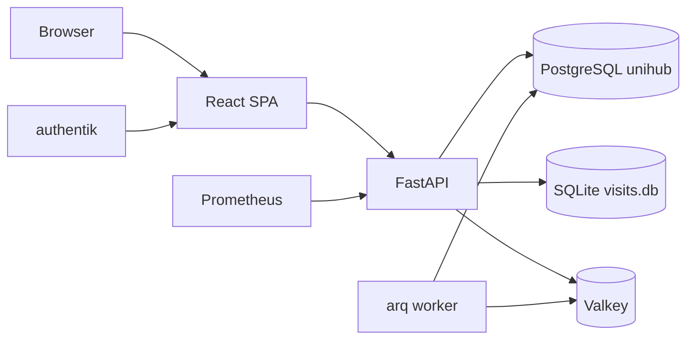

# UniHub Retail - Application Architecture

## Rol

UniHub Retail este aplicatia centrala pentru vanzarile retail MobiUp: dashboard operational, campanii focus, agenti, management de magazine, task-uri, HR, planificare target, salarii si raportare de vizite.

## Stack si runtime

| Zona | Tehnologie |
| --- | --- |
| Frontend | React 19, TypeScript, Vite 8, Tailwind CSS 4.3, TanStack Query |
| Backend | FastAPI, asyncpg, Python |
| Auth | Authentik OIDC BFF, encrypted Valkey session, HttpOnly cookie, JWT RS256/JWKS |
| DB | PostgreSQL `unihub` pe `unihub_postgres:5432` |
| Queue/cache | Valkey + worker `unihub-worker.service` pentru importuri async |
| Observabilitate | Prometheus `/metrics`, GlitchTip, structured logs |
| Public URL | `https://retail.unihub.ro/` |
| Service | `unihub-backend.service` |

Runtime probes are separated by contract: `/livez` is process-only, while
`/readyz` checks PostgreSQL and the Valkey-backed BFF session within a bounded
two-second deadline. `/health` remains a compatibility alias for `/readyz`.
Prometheus excludes these probes from the user-request SLI and uses a dedicated
public `/readyz` blackbox probe.

API-ul normalizeaza sau genereaza `X-Request-ID`, il returneaza clientului,
il include in loguri si GlitchTip si il propaga spre fluxurile interne si
joburile ARQ. Workerul pastreaza acelasi ID pentru jobul derivat de verificare
Grile, astfel incat fluxul API -> queue -> worker poate fi urmarit integral.

Workerul ARQ serializeaza joburile grele, are timeout explicit de 30 minute si
la SIGTERM asteapta bounded jobul activ inainte sa inchida conexiunile Valkey
si PostgreSQL. Unitatea systemd acorda 75 secunde pentru shutdown-ul controlat.
La startup, workerul inchide rezervarile de import ramase `processing` dupa o
oprire necontrolata. Tranzactia PostgreSQL intrerupta este deja rollback-ata,
rezervarea devine `failed`, iar retry-ul ARQ poate porni imediat.

Pool-ul PostgreSQL seteaza server-side `statement_timeout=120s`,
`lock_timeout=10s` si `idle_in_transaction_session_timeout=60s` implicit.
Valorile sunt configurabile prin `.env`; `command_timeout` asyncpg este aliniat
cu timeoutul de statement pentru a nu lasa query-uri abandonate sa continue.

Schema PostgreSQL este administrata exclusiv prin runnerul one-shot
`unihub-retail-migrate.service`. Baseline-ul `schema_v2.sql` este inghetat,
iar fiecare delta are checksum imutabil in manifest si in DB. Web-ul verifica
read-only starea migrations la startup si nu executa DDL sau backfill.

## Diagrama



## Meniuri

| Meniu principal | Scop |
| --- | --- |
| Hub | KPI-uri, comparatii perioade, carduri speciale, monitorizare AI Forecast |
| Focus | Incentive, Promo, Concurs, Folii premium, produse focus |
| Agenti | overview agenti, stabilitate, miscari, Grile, analiza si evaluare |
| Management | `Manageri`, `Calculator Target`, `Salarii`, `P&L` |
| Setari | importuri vanzari, exporturi configurabile, setari aplicatie si erori |

Navigatia principala ramane plata: sidebar-ul contine doar meniurile principale.
Subtaburile Management sunt randate in interiorul ecranului Management, cu
acelasi model de interactiune folosit de celelalte ecrane cu subsectiuni.

## Functionalitati majore

- KPI retail si istoric lunar.
- Hub -> `Luna in curs` -> `AI Forecast` afiseaza forecasturi salvate offline,
  cu doua comutatoare: `Luna curenta / 12 luni` si `Valoare / Bucati`.
  Pentru luna curenta compara forecastul cumulat la zi cu realizatul importat
  la nivel de retea, manager si magazin. Pentru `12 luni` afiseaza prognoza
  lunara agregata pe retea, RM si magazin. Modelul TimesFM/XReg nu ruleaza in
  requesturile Hub; rezultatele sunt importate in tabelele `ai_forecast_*`.
- Filtre globale firma / regional / magazin / agent.
- Campanii promo, incentive si concursuri config-driven.
- Analiza agentilor, lifecycle, salarii.
- Salarii are RBAC backend: acces pentru `unihub-manager`, `unihub-admin`,
  `authentik Admins` si grupul rezervat `unihub-hr`; agentii si Team Leaderii
  primesc 403. Frontend-ul ascunde tabul, dar backend-ul ramane autoritativ.
  Accesul permis/refuzat si exporturile din tab sunt logate fara CNP sau
  valori salariale.
- Hub -> `Luna in curs` -> `Overview` foloseste `agent_salary_links` ca sa
  lege codul de agent din reporting de numele din `salary_records` si sa
  afiseze sumarul salarial in drawerul de performanta al agentului. Endpointul
  ramane sub `/salarii`, deci respecta acelasi RBAC ca tabul Salarii.
- RBAC-ul Retail este centralizat in `backend/permissions.py`. Rapoartele
  generale raman disponibile utilizatorilor autentificati, dar Management,
  HR, Calculator Target si exporturile server-side cer rol managerial
  (`unihub-manager`, `unihub-hr`, `unihub-admin` sau `authentik Admins`).
  Scrierile business cer `unihub-manager` sau admin. Importurile vanzari
  raman admin-only, iar calcularea/editarea/finalizarea in Calculator Target
  ramane limitata la allowlist-ul operational.
- Rate limiting-ul Retail este centralizat in `backend/rate_limits.py` si se
  aplica pe auth proxy, uploadul importurilor, exporturi server-side, joburi
  Grile, mutatii Target Calculator si scrieri business. Limitele sunt
  configurabile prin variabilele `RATE_LIMIT_*`; uploadul de vanzari ramane
  limitat separat prin `MAX_SALES_UPLOAD_BYTES`.
- Management magazine, scoruri CRM, task-uri, concedii si documente lunare de target.
- Management -> `P&L` prezinta sumar financiar, evolutie lunara, structura pe
  categorii si performanta pe magazine, cu lunile estimate marcate explicit.
  Subtabul si endpointurile `/api/store-pnl/*` sunt disponibile exclusiv
  grupului OIDC dedicat P&L, peste accesul general Management; ascunderea din
  frontend este dublata de sesiunea BFF si verificarea autoritativa OIDC in backend.
- Raportare vizite citita din SQLite shared.
- Agenti -> Grile include verificare read-only si inchidere de luna; actiunile
  privilegiate raman protejate individual in backend.
  Operatiile lunare ruleaza exclusiv in worker, sunt rezervate in DB inainte de
  enqueue si permit o singura operatie activa pe luna inchisa. Resetul live are
  checkpoint persistent per magazin; magazinele deja confirmate sunt sarite la
  retry, iar checkpointurile incerte blocheaza reluarea automata pana la
  verificare manuala.
- Import vanzari si refresh reporting agregat.
- Setari -> Importuri permite si incarcarea raportului POS de promo al firmei:
  administratorul selecteaza luna si data cutoff, iar aplicatia valideaza foaia
  `AccesoriPromoLunar` (SiteCode, Cod, Promo Luna Curenta), pastreaza fisierul
  sub `data/promo_actuals/` si il leaga automat de promotiile active ale lunii.
  Pana la cutoff raportul devine sursa de adevar pentru Focus si exporturi;
  dupa cutoff calculul continua din regula pe bonuri.
- Importul de vanzari este rezervat administratorilor, accepta numai Excel in
  limita configurata (implicit 32 MB) si ruleaza exclusiv in worker. Hash-ul
  continutului deduplica retry-urile aflate deja in coada, iar DB permite un
  singur snapshot `processing` per luna. Lease-urile mai vechi de o ora sunt
  inchise ca `failed`, fara stergerea istoricului de audit; restartul workerului
  reconciliaza imediat lease-urile intrerupte.
- Exporturi si rapoarte pentru management. `Setari -> Exporturi` include un
  builder Excel controlat server-side cu doua moduri: `Tabel detaliat` pentru
  Agenti, Magazine, RM, ASM si `Incentive pe produs` cu filtre pe
  luni/agent/magazin/firma/RM/ASM,
  coloane bifabile, evolutii lunare/zilnice, preview si download `.xlsx`;
  respectiv `Evolutie zilnica` pentru comparatii intre luni sau ani. Exportul
  `Incentive pe produs` are coloane fixe pentru categorie, subcategorie, cod,
  produs, excluderi promo, cantitati eligibile si plata calculata la nivel de
  magazin. Respecta acelasi filtru `Include magazine inchise` ca celelalte
  dataseturi, astfel incat totalurile sa poata fi comparate direct. Toate modurile
  de export au selector comun cu ani, luni si zile bifabile; zilele selectate
  se aplica fiecarei luni rezultate din combinatia an-luna. Modul
  zilnic genereaza workbook cu foi separate `General`, `ASM`, `Magazine` si
  `Agenti`, aliniaza valorile pe ziua lunii, adauga delta intre doua luni
  selectate si pune graficul line doar pe foaia `General`.

Filtrele principale sunt gestionate in `App.tsx` si persistate in
`localStorage` separat pe zone: Hub, Focus si Agenti. Hub si Focus pot porni
cu aceleasi valori initiale, dar fiecare isi pastreaza ultima selectie dupa
refresh.

Frontend-ul foloseste lazy-loading pe ecranele principale (`Hub`, `Focus`,
`Agenti`, `Management`, `Setari`). Recharts este izolat in chunk-ul `charts`,
dar nu este preincarcat din `index.html`; se descarca la primul ecran cu
grafice. TanStack Query are default `staleTime=60s` si `gcTime=10min`, iar
polling-ul pentru operatii Grile ramane explicit per-query.
Aplicatia este invelita la radacina in `ErrorBoundary`; fallback-ul nu expune
stack trace in UI si trimite erorile catre GlitchTip/Sentry.
PWA precache exclude logo-urile mari nefolosite in UI (`logo-horizontal`,
`logo-inverted`, `logo-mark`); sidebar-ul foloseste `favicon-64.png`, iar
imaginile autentificate din Vizite folosesc lazy loading.
Calitatea frontend are doua praguri: `npm run lint` ruleaza ESLint flat config
cu React Hooks si TypeScript rules, iar `npm run typecheck:strict` aplica
strict TypeScript pe subseturi curate. `npm run typecheck` ramane pragul
general pentru toata aplicatia.

Tabul principal `Agenti` are subsectiunile `Prezentare Generala`, `Grile` si
`Analiza agenti`. Ultima reutilizeaza `AgentEvaluationSubtab` si include
evaluarea actuala plus evaluarea noua 0-100. Aceasta analiza nu mai apare in
Management; subtaburile Management sunt Manageri, Calculator Target, Salarii
si P&L (ultimul fiind conditionat de capabilitatea backend).

## Arhitectura backend

Backend-ul foloseste modelul `router -> service -> repository`.

| Domeniu | Exemple |
| --- | --- |
| Dashboard | `routers/dashboard.py` -> `services/dashboard_service.py` -> `repositories/dashboard.py` |
| Agenti | `agents.py` pe toate cele 3 straturi |
| Campanii | `campaigns.py` pe toate cele 3 straturi |
| Concursuri | `routers/contests.py` -> `services/contests.py` -> `repositories/contests.py` |
| HR/CRM/Tasks/Calculator Target | straturi separate per domeniu |
| Grile lunar | `services/grile_monthly.py` -> `repositories/grile_monthly_operations.py` + state machine pur |
| Import | `services/importer.py`, `services/imports.py`, job-uri Valkey |
| Exporturi | `routers/exports.py` -> `services/exports.py` -> `repositories/exports.py` |

Repository-ul Grile detine rezervarea tranzactionala, expirarea lease-urilor si
checkpointurile per magazin. Claim-ul `pending -> running` si finalizarea din
`running` sunt compare-and-set; un worker concurent sau intarziat nu poate
suprascrie un checkpoint terminal. Service-ul pastreaza doar orchestrarea
Google/filesystem si wrapper-ele publice folosite de worker.

Dashboard-ul operational citeste KPI-urile din agregatele `reporting_*`.
Frontendul reda aceleasi coloane curente si istorice RM/Magazine/Agenti prin
componenta tipizata `dashboard/BreakdownTable.tsx`, care centralizeaza tabelul
sortabil si exportul Excel fara a schimba payload-urile API.
`Dashboard.tsx` orchestreaza query-urile, agregarea multi-luna, filtrele si
state-ul comun; `dashboard/CurrentDashboard.tsx` si
`dashboard/HistoryDashboard.tsx` sunt view-uri tipizate fara data fetching
propriu.
Tabelele curente RM si Magazine returneaza atat procentul realizat
(`proc_realizare_target`), cat si proiectia la luna intreaga
(`forecast_target_pct`) calculata pe baza `import_snapshots.is_month_final` si
ultimei zile importate.

`/api/dashboard/all` calculeaza contextul promo/incentive o singura data per
request si il reutilizeaza pentru sumar si cardurile speciale. Reutilizarea
este strict request-local, fara cache global care ar necesita invalidare dupa
import. Latenta celor 15 componente fixe este expusa in Prometheus prin
`dashboard_component_duration_seconds`; etichetele nu includ filtre sau date
business. Fan-out-ul ruleaza cel mult patru componente independente simultan,
lasand capacitate in pool pentru readiness si alte requesturi; timpul de
asteptare pentru slot este expus prin `dashboard_component_queue_seconds`, tot
cu etichete finite. Componenta `daily_last_year` (vanzarile zilnice din aceeasi luna a
anului anterior) este obtinuta printr-un query paralel pe
`reporting_agent_day` cu `import_month = YYYY-1-MM` si aceleasi filtre de
scope; in graficul Hub "Evolutie zilnica" este afisata ca linie comparativa
verde, impreuna cu o linie de prognoza portocalie care scaleaza forma zilnica
a anului trecut cu raportul de crestere curent pe zilele comune.

Istoricul Hub ruleaza pe structura curenta de magazine. Cand un manager activ
este selectat, istoricul centralizeaza vanzarile istorice ale magazinelor
active alocate acum acelui manager, chiar daca in lunile vechi magazinele erau
sub alt manager. Magazinele inchise sunt excluse implicit; UI-ul are optiune
dedicata pentru includerea lor. In subtabul Istoric, utilizatorul poate bifa
mai multe luni; dashboard-ul combina raspunsurile lunare existente si
recalculeaza totaluri, procente, mixuri, tabele si exporturi pentru selectia
agregata.

Cardul Hub `Comparatie perioade` foloseste o cohorta like-for-like: magazinele
cu vanzari Retail in luna analizata sunt considerate deschise pentru acel card,
iar luna trecuta si aceeasi luna din anul anterior sunt agregate numai pentru
aceleasi `site_code`. Cand selectia curenta este pe RM/firma, cohorta se
stabileste din apartenenta curenta; istoricul magazinelor ramane inclus chiar
daca acestea au fost mutate ulterior intre RM-uri sau firme.

## Baze de date

### PostgreSQL `unihub`

Familii de tabele:

| Familie | Tabele reprezentative |
| --- | --- |
| Master data | `stores`, `store_targets`, `focus_products` |
| Tranzactii | `sales_transactions`, `historical_annual_sales` |
| Campanii | `incentive_campaigns`, `incentive_products` |
| Reporting | `reporting_agent_*`, `reporting_item_*`, `reporting_focus_item_month`, `reporting_category_month` |
| AI Forecast | `ai_forecast_runs`, `ai_forecast_store_month`, `ai_forecast_store_day` |
| Management | `tasks`, `leave_requests`, `attendance_records`, `store_scores`, `salary_records`, `agent_salary_links`, `agent_targets`, `store_pnl_monthly` |
| Planificare target | `target_scenarios`, `target_scenario_rows`; publicare finala in `store_targets` |
| Operare | `import_snapshots`, `visits_snapshot`, `error_logs` |

`stores` este master data curenta pentru apartenenta magazinelor. In Retail
exista un singur layer activ de management; coloanele `regional` si `asm` sunt
pastrate pentru compatibilitate cu rapoartele, dar pentru magazinele active din
ultima luna ele trebuie sa indice acelasi manager. Importul celei mai noi luni
actualizeaza structura curenta si marcheaza inactive magazinele care nu mai
apar. Importurile istorice actualizeaza doar intervalul
`first_seen_month`/`last_seen_month` si nu au voie sa rescrie managerul curent
sau sa reactiveze magazine inchise.

P&L-ul financiar lunar pe magazin este pastrat in `store_pnl_monthly` la
granularitatea companie, luna, cod istoric de locatie si categorie contabila.
Importul din `backend/scripts/import_store_pnl.py` deduplica fisierele identice,
alege snapshotul anual cu cea mai buna acoperire si importa numai valori reale.
Codurile istorice din fisiere nu sunt fortate peste `stores.site_code`, iar
orice luna estimata ulterior trebuie marcata explicit cu `data_kind=estimated`.
Legaturile auditabile catre master-data Retail sunt in `store_pnl_site_links`;
scriptul `backend/scripts/map_store_pnl_sites.py` salveaza metoda, scorul si
starea de review, fara sa forteze codurile istorice care nu mai exista in
`stores`.

Lunile P&L lipsa pot fi generate cu
`backend/scripts/estimate_store_pnl.py`. Modelul scaleaza veniturile si
costurile variabile cu vanzarile reale ale magazinului, costul salarial cu
raportul istoric dintre P&L si salariul net importat, iar costurile fixe cu
mediana recenta si aceeasi luna din anul anterior. Scriptul afiseaza backtestul
inainte de import, scrie numai `data_kind=estimated` si nu suprascrie valori
`actual`.

### AI Forecast

Forecasturile AI sunt persistate in PostgreSQL. `ai_forecast_runs` marcheaza
fiecare rulare cu `metric` (`sales_value` sau `units`) si `horizon`
(`current_month` sau `rolling_12m`). `/api/ai-forecast/current` citeste ultima
rulare `completed` pentru luna si metrica ceruta; daca nu exista, cauta o
rulare care foloseste luna ceruta ca `source_month`, ca Hub sa poata afisa
forecastul lunii urmatoare inainte sa existe importuri pentru acea luna.
`/api/ai-forecast/rolling-12` citeste cele 12 rulări lunare salvate pentru
urmatoarele 12 luni, ancorate prin `metadata.anchor_month`.

Fluxul operational curent este:

1. TimesFM 2.5 ruleaza in afara aplicatiei, cu XReg calendaristic
   (`xreg + timesfm`) pe serii lunare.
2. Backtestul comparativ se face cu
   `backend/scripts/run_ai_forecast_backtest.py`, care compara baseline-uri
   locale (`seasonal_naive`, `seasonal_moving_average`, `seasonal_last3`) cu
   TimesFM simplu si modurile XReg (`xreg + timesfm`, `timesfm + xreg`) pe
   aceeasi fereastra walk-forward. Rularea operationala se face cu
   `backend/scripts/run_ai_forecast_xreg.py`. Scriptul poate prognoza
   `sales_value` sau `units`. Pentru backtest ruleaza fiecare luna cu contextul
   disponibil pana in luna precedenta; pentru operational `--operational`
   trimite un singur forecast multi-step, fara sa introduca luni viitoare cu
   zero in context. Outputurile sunt scrise sub `backend/outputs/ai_forecast/`.
3. Pentru magazinele cu istoric prea scurt pentru XReg, scriptul foloseste
   fallback sezonier pe media ultimelor 3 luni, scalata cu sezonalitatea
   aceleiasi luni din anul anterior. Randurile exportate pastreaza metoda in
   coloana `method`.
4. Magazinele inchise in luna sursa pot fi excluse din rulare prin
   `--exclude-site-code`. Implicit, fluxul exclude inchiderile din iunie 2026:
   `CRFVUL` si `CRFARENA`.
5. Rezultatul lunar per magazin se importa cu
   `backend/scripts/import_ai_forecast.py`. Pentru `current_month`, importul
   genereaza si `ai_forecast_store_day`; pentru `rolling_12m`, creeaza cate o
   rulare lunara si nu genereaza curba zilnica.
6. Curba zilnica este derivata din profilul zilnic al aceleiasi luni din anul
   precedent, la nivel de magazin, dar este aliniata pe calendarul lunii
   forecastate prin ordinalul zilei din saptamana (ex. prima sambata la prima
   sambata). Fallback-ul este uniform cand lipseste profilul.
7. Hub compara `ai_forecast_store_day` cumulat pana la ultima zi importata cu
   realizatul din `reporting_agent_day` / `reporting_agent_month`.

Decizie de model actualizata la 2026-07-09: rularea afisata in aplicatie pentru
iulie 2026 foloseste `xreg + timesfm` profil `v2`, importat ca
`monthly_xreg_v2_excl_closed` pentru valoare si
`monthly_xreg_units_v2_excl_closed` pentru bucati. Forecastul curent este
3.943.570 RON si 42.724 bucati pe 74 magazine active. Profilul `v1`
(`monthly_xreg_standard_v2_excl_closed`, 3.884.172 RON si 42.114 bucati) ramane
benchmark stabil pentru analiza de final de iulie. Profilul `v3` nu a adus
imbunatatire fata de `v1`.

### Campanii si concursuri

Campaniile incentive per-produs sunt persistate in PostgreSQL:
`incentive_campaigns` si `incentive_products`. Valorile per cod pot fi
importate din Excel cu `backend/scripts/import_incentive_campaign.py`.
`incentive_products.valid_from/valid_to` permite mai multe mecanisme in aceeasi
luna; vanzarea foloseste lista si reward-ul active la data sa, iar rezultatele
per perioada se insumeaza inaintea multiplicatorului lunar. Pragurile sunt
exact 90% pentru plata 50% si 100% pentru plata integrala.

Promotiile speciale si concursurile sunt configurate prin JSON-uri
operationale din `data/`, care sunt gitignored pe server:

- `data/hub_specials.json` — promotii speciale pentru cardurile Hub si tabul
  Focus -> Promo. In Focus, mai multe promotii active pe aceeasi luna sunt
  selectabile prin `promotion_key`; config-ul expune `key`, `rule_type`,
  perioada si, pentru regulile bazate pe anexe, fisierul Excel + sheet-urile.
  Optional, o promotie poate avea `actuals_source_file` + `actuals_sheet`,
  folosite ca raport saptamanal POS cu reduceri aplicate efectiv. Cand exista,
  raportul corecteaza promo si excluderea din incentive pana la
  `actuals_cutoff_date`; daca data lipseste, fallback-ul este data modificarii
  fisierului minus o zi. Pentru zilele de dupa cutoff, regula pe bonuri ramane
  activa, deci ingestul zilnic poate continua fara sa suprascrie corectia.
- `data/contests.json` — concursuri config-driven, cu perioada, scope,
  reguli de punctaj si premii.

Pentru campaniile iunie 2026, regulile promo comune sunt in
`services/promo_copurchase.py`. Helperul acopera:

- regula existenta `selected_item_copurchase` pentru promo actuala;
- `same_model_screen_camera` pentru folie ecran + folie camera acelasi model;
- `trigger_discounted` pentru capac Cellara + husa universala Cellara.

Helperul este folosit de:

- cardul Hub special pentru promotie;
- Focus -> Promo (`promo_qualifying_bons`, `promo_discounted_units`,
  `promo_active_stores`, `promo_active_agents`);
- excluderea unitatilor reduse din incentive; aceasta se face peste toate
  promotiile active ale lunii, independent de `promotion_key` selectat in UI;
- punctajul de concurs pentru bonurile promo.

In interfata Focus, fiecare promotie are tabele separate pentru Magazine si
Agenti, calculate din rezultatul promotiei selectate. Incentive afiseaza toate
randurile disponibile de agenti si magazine, plus `Incentive potential`:
valoarea care s-ar plati la realizare 100% a targetului, inainte de
multiplicatorul curent. Sumarul Incentive separa mecanismele active in aceeasi
luna si include distributia pe subcategorii. Tabelele din toate subsectiunile Focus, inclusiv
Concurs si Folii premium, pot fi exportate in Excel. Exporturile Focus pe
randuri de magazine sau agenti includ explicit `Firma` si `Magazin` cand
payload-ul are acele metadate.

Importul zilnic de vanzari rescrie snapshot-ul lunii prin
`replace_month_snapshot`, apoi reconstruieste agregatele `reporting_*`. Raportul
promo saptamanal nu este parte din ingestul zilnic; se pastreaza separat in
`/opt/Mobiup/docs` si este citit la runtime. Daca fisierul lipseste sau nu este
configurat, toate calculele revin la regula pe bonuri.

`promo_qty` din tabelele operationale Hub ramane agregatul simplu din
`reporting_item_day`; headline-urile de campanii folosesc metricile promo
dedicate sau raportul POS corectiv.

### Salarii

Tabela `salary_records` este sursa citita de tabul **Management -> Salarii**.
Datele vin din fisierele HR din `/opt/Mobiup/docs/comisioane/`, cate un
fisier lunar per firma. Istoricul initial este pastrat in
`/opt/Mobiup/docs/comisioane/salarii-istoric.zip`.

Campul `salary_records.total_salary` reprezinta venitul total folosit in
raportare si include bonurile de masa:

```text
TOTAL SALARIU + BONURI MASA
```

Maparea principala:
- `CNP` -> `cnp`
- `Nume Prenume` -> `full_name`
- `Denumire locatie` -> `locatie` si optional `site_code`
- numele fisierului -> `year`, `month`, `company_name`

`site_code` este completat doar cand maparea locatiei este sigura. Randurile
fara `site_code` sunt incluse in totalurile salariale generale, dar nu pot fi
atribuite corect filtrelor bazate pe `stores` (`regional`, `asm`, magazin).

Media salariala folosita in toate cardurile este:

```text
media valorilor agent-luna care sunt >= 2.000 RON
```

Identitatea salariala persistata foloseste `person_id` opac. CNP-ul retinut si
maparea sa sunt limitate la `salary_private.people` si la procedurile aprobate
de import/backfill; repository-urile runtime nu citesc CNP. Pentru randurile
istorice, backfill-ul a derivat acelasi ID HMAC din CNP sau din numele normalizat
ca fallback, pastrand compatibilitatea API.
Inainte de agregare, read model-ul elimina
duplicatele complet identice. Astfel, un agent cu doua randuri de plata in
aceeasi luna contribuie cu suma ambelor randuri, dar este numarat o singura
data in numitor. Valorile agent-luna sub 2.000 RON sunt considerate fractii si
sunt excluse numai din medii. Totalurile salariale, numarul de agenti si
istoricul raman complete.

Endpointul `/salarii/summary`, folosit de cardul **Salarii vs Vanzari**,
consolideaza afisarea pe `locatie + company_name`. Aceasta evita duplicatele
vizuale cauzate de contracte duble, part-time sau site_code-uri istorice pentru
aceeasi locatie. Consolidarea este doar la nivel de query/read model si nu
modifica randurile din `salary_records`.

### Grila de salarizare ASM (Management -> Manageri)

Pentru ASM-ii activati (momentan `Mihai Condorateanu`), subsectiunea
„Grila salarizare" din randul expandat al managerului calculeaza
salariul dupa grila de comisionare ASM: salariu fix 4.000 lei + comision
realizare target zona + comision pe insula/locatie (per `site_code`,
insumat) + comision omogenitate (>50% insule cu minimum 99% realizare) +
comision Acc Focus. Calculul ruleaza in `services/asm_salary.py` (modul
pur, fara DB, testat unitar) si este expus prin
`GET /api/hr/asm-salary/{asm_name}?month=`, sub `require_salary_access`
(acelasi set de roluri ca tabul Salarii). Pentru luna curenta partiala
comisioanele folosesc procentul prognozat la final de luna
(`forecast_factor` din `services/forecast.py`); pentru lunile incheiate
se folosesc valorile finale. Acc Focus % este un raport de cantitati,
astfel ca nu se scaleaza cu forecast_factor. Pragurile din grila
(79/84/89/94/99/109, Acc Focus 5/5,5/6/6,5/7) includ deja regula
„1% sub prag", deci se folosesc exact ca atare, fara o alta toleranta
suplimentara. Grila este un calcul de comisionare independent de
`salary_records` (care ramane sursa de payroll a tabului Management ->
Salarii); datele pe insule provin din `reporting_agent_month` agregat
per `site_code` si din `store_targets`, cu apartenenta ASM curenta
(`stores.asm`), consistent cu istoricul ASM.

### Targete agent

Tabela `agent_targets` este un override optional pentru targetele reale per
agent. Sync-ul curent este legat de verificarea zilnica Grile si citeste
read-only celulele `D2/D8` si `D16/D22` din Google Sheets, numai pentru
managerii activati prin `GRILE_AGENT_TARGET_ENABLED_MANAGERS`. Implicit sunt
activati Andrei Stancu, Adrian Badea, Mihai Condorateanu si Elena Minca.

Managerii exclusi prin `GRILE_AGENT_TARGET_DISABLED_MANAGERS` (implicit
Bogdan Radu si Bogdana Costan) nu primesc override-uri si raman pe fallback-ul
istoric. Cand targetul agentului lipseste din grila sau numele nu se poate
mapa sigur la codul de agent Retail, randul din `agent_targets` nu se scrie
sau este scos pentru magazinul citit, deci tabelul Hub revine la
`store_targets.target_value / numar agenti activi`.

Nu exista validare ca suma targetelor celor doi agenti trebuie sa fie egala cu
targetul magazinului. Diferentele sunt acceptate deoarece pot exista agenti,
TL sau inlocuitori suplimentari pe tura.

### Grile salariale in Agenti

Sub-tab-ul `Agenti -> Grile` administreaza Google Sheets permanente pentru
grilele salariale. Retail pastreaza Sheet ID-urile in `grile_sheets`, ruleaza
verificari async in `grile_runs` si salveaza rezultatul per magazin in
`grile_store_status`.

Retail compara `K5/L5` din grila cu `store_targets` si
`reporting_item_month.total_sales` pe `site_code`. Inchiderea de luna ruleaza
nativ in Retail: finalizare salarii, export arhiva XLSX/ZIP si reset lunar
controlat al range-urilor editabile. Output-urile sunt generate in
`backend/outputs/grile`. Verificarile async rezerva atomic un singur run
`queued/running` per luna inainte de enqueue; workerul actualizeaza heartbeat-ul,
iar o rezervare abandonata poate fi inlocuita dupa doua ore.

### Calculator Target

Sub-tab-ul `Management -> Calculator Target` foloseste endpointurile
`/api/target-calculator` si urmeaza fluxul:

1. Creeaza sau recalculeaza unicul `draft` al lunii tinta; recalcularea nu
   creeaza versiuni paralele. Panoul parametrilor de calcul este afisat numai
   proprietarului configurat. Fiecare mutatie creste `revision`; scrierile cu
   o versiune veche primesc 409, iar un advisory lock tranzactional serializeaza
   crearea initiala pentru aceeasi luna. O luna finalizata nu se recalculeaza.
2. Stabileste cohorta din magazinele cu vanzari in ultima luna disponibila
   anterior lunii tinta, apoi elimina magazinele cu excluderi active in
   `target_calculator_store_exclusions`; datele de apartenenta RM/firma sunt
   snapshot in randurile draftului.
3. Calculeaza propunerea `seasonal_blended_multiyear_v1`: porneste de la
   forecastul lunii curente, aplica un factor sezonier blended magazin / manager
   / retea si aloca top-down targetul total dupa estimarea bruta. Finalizatorul
   poate comuta in cardul de calcul intre `Anul trecut` si `Multi-year`, cu
   multi-year implicit. Daca luna curenta este partiala, forecastul foloseste
   regula comuna Hub/CRM si este salvat impreuna cu realizatul importat.
4. Permite completarea valorii `final_target` pe fiecare locatie si exportul
   Excel al draftului sau rezultatului final. In drafturile noi, `Final manager`
   este `NULL`/gol pana la completarea explicita de catre manager; UI-ul il
   evidentiaza, iar finalizarea este blocata cat timp exista randuri goale.
   Rezumatul pe manager afiseaza cresterea propunerii fata de forecastul lunii
   curente si cresterea sezoniera observata anul trecut intre luna baza si
   luna tinta.
5. Tabelul de lucru permite filtru multi-select pe locatie. Click pe numele
   locatiei deschide un drawer cu 16 luni de istoric. Graficul din drawer
   comuta intre vanzari versus target, Bon2Acc si Focus/Acc; KPI-ul
   `Zile cu vanzari` este numarat din datele distincte
   `reporting_agent_day.sale_date`, iar overview-ul agentilor foloseste luna
   cohortei.
6. La finalizare inlocuieste targetele oficiale ale lunii din `store_targets`
   cu exact cohorta aprobata; Hub si CRM consuma apoi noile valori. Endpointul
   precum si actiunea de calcul/recalculare sunt rezervate grupurilor OIDC
   dedicate configurate pentru aceasta capabilitate.

Separarea dintre draftul de calcul si `store_targets` previne modificarea targetelor
oficiale in timpul simularilor si pastreaza contextul necesar pentru audit sau
extinderea formulei.

### SQLite shared

- `data/visits/visits.db`
- Retail citeste raportarea vizitelor; FieldOps este noul flux operational pentru vizite.
- In Retail, filtrarea si gruparea din meniul Vizite folosesc mapping-ul curent
  `stores.site_code -> firma/regional/asm`, nu valorile istorice salvate in
  randurile SQLite. Vizitele FieldOps pastreaza codul magazinului in
  `visits.magazin`.
- `visits_snapshot` este o proiectie completa a agregatelor SQLite. Sync-ul
  inlocuieste proiectia intr-o singura tranzactie: randurile disparute din
  sursa nu raman stale, iar o eroare de insert pastreaza snapshotul anterior
  prin rollback.

## Integrari

- authentik pentru identity.
- Valkey pentru job queue.
- Hub consuma KPI-uri Retail prin API intern.
- Prometheus si Grafana pentru metrics.
- GlitchTip pentru erori.

## Teste si calitate

- Backend: `pytest`, `mypy`.
- Frontend: `vitest`, `tsc`, Playwright.
- Routerele principale au fost refactorizate la arhitectura pe 3 straturi.

## Puncte de intrare

```text
src/App.tsx
src/lib/tabs.ts
backend/main.py
backend/db/schema_v2.sql
backend/services/
backend/repositories/
```

## Gotchas

- DB-ul Retail este pe port `5432`, nu clusterul DWH de pe `5433`.
- Reporting-ul operational se citeste din tabelele `reporting_*`, nu direct din `sales_transactions`, cu exceptii controlate.
- Magazinele `TR %` sunt excluse din logica Retail.
- Selectorul de luni include doar luni cu importuri finalizate
  (`import_snapshots.status='completed'`). Lunile planificate/configurate fara
  vanzari importate nu se forteaza in UI.
- Cand `site_code` este prezent, domina scope-ul istoric.
- In `Comparatie perioade`, RM/firma selecteaza cohorta curenta; coloanele istorice filtreaza dupa codurile magazinelor din cohorta, nu dupa apartenenta istorica.
- Vizitele sunt o dependinta istorica sensibila; nu modifica `visits.db` fara sa verifici fluxurile FieldOps/Retail.
