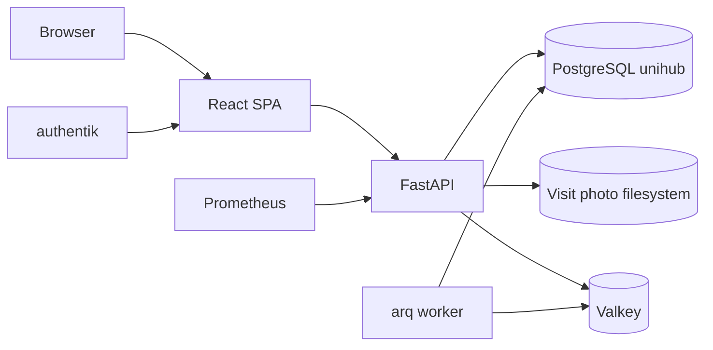

# UniHub Retail - Application Architecture

## Rol

UniHub Retail este aplicatia centrala pentru vanzarile retail MobiUp: dashboard
operational, campanii Focus, agenti, performanta managerilor, planificare
target, salarii, P&L si raportare de vizite.

Identitatea release-ului curent nu este declarată manual în sursă. CI generează
`RELEASE_MANIFEST.json` pentru SHA-ul exact certificat, îl leagă de artefact/SBOM
prin digesturi și îl semnează; deploy-ul verifică aceeași identitate și păstrează
recordul de promovare runtime. Notele de release din `docs/releases/` sunt istorice.

## Stack si runtime

| Zona | Tehnologie |
| --- | --- |
| Frontend | React 19, TypeScript, Vite 8, Tailwind CSS 4.3, TanStack Query |
| Backend | FastAPI, asyncpg, Python |
| Auth | Authentik OIDC BFF, encrypted Valkey session, HttpOnly cookie, JWT RS256/JWKS |
| DB | PostgreSQL `unihub` pe `unihub_postgres:5432` |
| Queue/cache | Valkey + workeri ARQ separați pentru operations, imports, Grile, exports și salary-exports |
| Observabilitate | Prometheus `/metrics`, GlitchTip, structured logs |
| Public URL | `https://retail.unihub.ro/` |
| Service | `unihub-backend.service` |

Runtime probes are separated by contract: `/livez` is process-only, while
`/readyz` checks PostgreSQL, the Valkey-backed BFF session and JWKS bootstrap/
bounded-stale usability within a bounded two-second deadline. Startup prewarms
JWKS; `jwks_readiness_state{state="disabled|absent|fresh|stale|failed"}` exposes
the finite state. A transient IdP failure stays ready only while a validated key
cache remains inside `JWKS_MAX_STALE_SECONDS`. `/health` remains a compatibility
alias for `/readyz`.
Prometheus excludes these probes from the user-request SLI and uses a dedicated
public `/readyz` blackbox probe.
The systemd unit waits up to 90 seconds for the local Valkey listener before
starting Uvicorn, so a host reboot cannot create avoidable session-backend
errors while Docker restores the dependency.

Frontend RUM este activ în build-ul live prin integrarea GlitchTip/Sentry
`browserTracingIntegration`, cu eșantionare 10% pentru navigări/tranzacții și
taguri finite pentru tipul conexiunii și `saveData`. Vite folosește
`VITE_FRONTEND_GLITCHTIP_DSN` exclusiv; DSN-ul backend rămâne separat în `BACKEND_SENTRY_DSN`. Raportul zilnic
central din Command Center verifică inclusiv că DSN-ul RUM este compilat în
artefact, apoi corelează RUM/GlitchTip cu p95 și erorile Prometheus pe 24h.
În același boundary, `web-vitals` înregistrează numai LCP și INP, în
milisecunde, ca measurements și distribuții `web_vitals.lcp|inp`; atributele
sunt finite (`rating`, `navigation_type`), fără URL, identitate sau alte chei
cu cardinalitate necontrolată. Observarea pornește numai când DSN-ul este
configurat, iar importul dinamic nu intră în bundle-ul inițial fără RUM.
`sendDefaultPii=false`, `beforeSend` si `beforeSendTransaction` trec toate
evenimentele prin scrubberul frontend explicit: calea completa (inclusiv
transaction/span path), query/fragment, cookies, authorization, tokenuri si
campuri sensibile sunt eliminate recursiv, iar body-ul capturat de `ApiError`
este non-enumerable. Originea HTTP(S) poate ramane, dar niciun segment de ruta
care poate contine un identificator stabil nu este trimis.

API-ul normalizeaza sau genereaza `X-Request-ID`, il returneaza clientului,
il include in loguri si GlitchTip si il propaga spre fluxurile interne si
joburile ARQ. Workerul pastreaza acelasi ID pentru jobul derivat de verificare
Grile, astfel incat fluxul API -> queue -> worker poate fi urmarit integral.

Coada ARQ este opțională pentru procesul web. Startupul încearcă bounded un
pool best-effort, iar citirile autentificate și `/readyz` depind în continuare
numai de PostgreSQL plus sesiunea Valkey; nicio citire nu inițializează coada.
Crearea poolului ARQ este single-flight, are cooldown și recovery lazy fără
restart. Un eșec cunoscut înainte de publish produce 503 retry-safe; un răspuns
pierdut după publish rămâne `unknown` cu job/operație reconciliabilă și fără
retry orb. `not_found` este folosit numai după un lookup ARQ reușit, iar o
stare terminală PostgreSQL este autoritativă chiar dacă ARQ este indisponibil.

Workerul ARQ serializeaza implicit joburile grele (`ARQ_MAX_JOBS=1`). Configul
tipizat per web/operations/import validează poolurile, timeouturile, bugetul de
conectare sub 3 secunde, completion wait și retention. La SIGTERM, systemd
acordă 2460 secunde workerului operațional pentru completion wait 2400 și 1860
secunde import workerului pentru 1800, apoi se închid poolurile ARQ și DB.
La startup, workerul inchide rezervarile de import ramase `processing` dupa o
oprire necontrolata. Tranzactia PostgreSQL intrerupta este deja rollback-ata,
rezervarea devine `failed`, iar retry-ul ARQ poate porni imediat.

`backend/business_clock.py` este boundary-ul unic pentru date/luni business:
clock injectabil, datetime aware și `Europe/Bucharest`, cu instanțe persistate
UTC. Datetime naive este refuzat; duratele/cooldown-urile folosesc monotonic.

Pool-ul PostgreSQL seteaza server-side `statement_timeout=120s`,
`lock_timeout=10s` si `idle_in_transaction_session_timeout=60s` implicit.
Valorile sunt configurabile prin `.env`; poolurile, conexiunile one-shot și
migration runnerul folosesc același builder, iar `command_timeout` asyncpg este
aliniat cu timeoutul de statement pentru a nu lasa query-uri abandonate sa continue.
Fiecare ruta Dashboard creeaza inainte de dependency/pool resolution un deadline
monotonic unic (`DASHBOARD_REQUEST_DEADLINE_MS`, implicit 2500 ms, maximum
3000 ms). Acelasi buget limiteaza `pool.acquire()` si fiecare
`fetch/fetchrow/fetchval/execute`; batchurile si componentele concurente il
mostenesc, iar la expirare toti copiii sunt anulati si asteptati. Numai expirarea
tipizata devine 504; anularea clientului se propaga.
Fan-out-ul Dashboard are si un buget global per proces, configurabil prin
`DASHBOARD_GLOBAL_COMPONENT_CONCURRENCY` (implicit 6 si limitat automat la
`DB_POOL_MAX_SIZE - 2`). Astfel raman conexiuni pentru readiness si requesturi
operationale chiar cand ruleaza simultan mai multe batch-uri istorice.

Schema PostgreSQL este administrata exclusiv prin runnerul one-shot
`unihub-retail-migrate.service`. Baseline-ul `schema_v2.sql` este inghetat,
iar fiecare delta are checksum imutabil in manifest si in DB. Web-ul verifica
read-only starea migrations la startup si nu executa DDL sau backfill. Runnerul
foloseste explicit `MIGRATION_DATABASE_URL`, iar bootstrap-ul nou reaplica doar
seed-urile de date desemnate care nu pot exista in baseline-ul DDL.

Autoritatea DB este separată de identitatea de login. Migrarea 040 definește
grupurile NOLOGIN `unihub_web_read`, `unihub_business_write`,
`unihub_sales_import`, `unihub_finance_import`, `unihub_operations`,
`unihub_salary_export` și `unihub_migrate`, cu grants explicite pe obiecte
existente și fără
`GRANT ... ON ALL` sau default grants viitoare. Loginurile de proces sunt
`unihub_web`, `unihub_operations_worker`, `unihub_import_worker`,
`unihub_salary_export_worker` și `unihub_migration_runner`; fiecare conexiune
verifică principalul autentificat,
toate membershipurile directe/tranzitive și opțiunile lor, absența oricărui
grant direct/default ACL/obiect deținut de LOGIN, plus flagurile nonprivilegiate
inclusiv replication/bypass RLS. Scanarea `pg_shdepend` acoperă generic toate
clasele ACL/owner, inclusiv language, large object, tablespace, FDW/server,
column și parameter ACL. Autoritatea explicită este
obligatorie în producție. Contractul Finance rezervă principalul
`unihub_finance_import_worker`, dar acesta rămâne fără LOGIN/credential până la
un lot aprobat separat. Provisionarea autentifică LOGIN-ul înainte de schimbare
și aplică/verifică toate membershipurile într-o singură tranzacție. Numai
sales-import primește `TEMPORARY`.

Identitatea OS este separată la același nivel: web, operations, import, Grile,
export, salary-export și migration rulează sub șapte conturi system nologin
distincte. Transferul de artefacte folosește numai patru grupuri partajate și
directoare setgid `2770`/fișiere `0660`; systemd păstrează în paralel
`ProtectSystem=strict`, `ReadWritePaths` exact și mascarea namespace-ului
salarial. Fișierele de mediu sunt `root:<service-group> 0640`. Deployul mută
ownershipul persistent numai după backup și stop, verifică integral arborele
fără symlinkuri/special files și pornește procesele doar după contractul exact.

Migrarea 041 mută ownershipul obiectelor aplicației la NOLOGIN
`unihub_schema_owner`. Runnerul de migrare este `NOINHERIT`, poate face numai
`SET LOCAL ROLE unihub_schema_owner` în tranzacția migrației și nu primește
`CREATEROLE`, `CREATEDB`, superuser sau create pe schema `public`. Extensiile și
bootstrapul de schemă nouă cer un preflight administrativ separat; tranziția
istorică 039 -> 041 are un flag one-shot ne-persistent, acceptat numai pentru
superuserul autentificat direct și exact acel set restant. Web-ul și
workerii nu pot deveni owner. Funcțiile SECURITY DEFINER controlate au owner,
`search_path` și EXECUTE allowlist verificate.

Rolul legacy `unihub_runtime` este scos din uz printr-un pas separat de cutover:
după oprirea tuturor proceselor și verificarea absenței sesiunilor/membrilor,
scriptul fix îl setează `NOLOGIN`. ACL-urile istorice rămân inactive; niciun
principal nou nu poate moșteni rolul legacy.

Release-ul formal este o frontiera separata: un run manual `CI` pe `main`
impacheteaza sursa exact la `head_sha` plus `dist` verificat si publica SHA-256.
Approval-ul one-time leaga runul, SHA-ul si digestul; entrypointul root-owned
recompara sursa artefactului cu acel commit inainte de mutatii. Rollback-ul este
permis numai intre manifeste de migrari identice; altfel recuperarea este
strict roll-forward coordonat.

## Diagrama



## Meniuri

| Meniu principal | Scop |
| --- | --- |
| Hub | KPI-uri, comparatii perioade, carduri speciale, monitorizare AI Forecast |
| Focus | Incentive, Promo, Concurs, Folii premium, produse focus |
| Agenti | overview agenti, stabilitate, miscari, Grile, analiza si evaluare |
| Management | `Manageri`, `Calculator Target`, `Salarii`, `P&L` |
| Setari | importuri vanzari, verificare ERP read-only, exporturi configurabile, setari aplicatie si erori |

Navigatia principala ramane plata: sidebar-ul contine doar meniurile principale.
Subtaburile Management sunt randate in interiorul ecranului Management, cu
acelasi `SegmentedTabs` accesibil folosit de Hub, Focus, Agenti si Setari.
Pe desktop, textul functional foarte mic este ridicat la minimum 12 px, iar
scrollbar-urile pentru tabele si selectoare raman vizibile.
Pe mobil, `SegmentedTabs` pastreaza snap si scroll orizontal fara masca sau
fading la margini. Subtaburile secundare nu adauga un fundal suprapus; numai
optiunea activa este evidentiata. Shell-ul pastreaza filtrul global ca actiune
flotanta de 44 px, cu accent solid, contur si umbra vizibile peste cardurile
deschise. Indicatorul portocaliu arata numarul
filtrelor active. Shell-ul coordoneaza barele sticky cu navigarea de jos si
foloseste `safe-area-inset-bottom`. Ecranele cu tabele late pastreaza tabelul
pe desktop si expun carduri sau sectiuni progresive la viewport mobil.

Contractele publice backend sunt separate pe domenii in `backend/schemas/`
(`dashboard`, `agents`, `campaigns`, `premium_glass`, `contests`, `ai_forecast`
si `salarii`). `models.py` pastreaza re-exporturi compatibile pentru modulele
legacy. Lunile au format strict `YYYY-MM`, statusurile finite sunt expuse ca
enum-uri OpenAPI, iar valorile de import/target si procentele Vizite sunt
validate la boundary. Singura extensie intentionata este campul de perioada
din evaluarea agentilor: acesta accepta si etichetele agregate
`YYYY-MM..curent` si `custom`, deoarece randul poate reprezenta mai multe luni.

## Functionalitati majore

- KPI retail si istoric lunar.
- Hub -> `Luna in curs` -> `AI Forecast` afiseaza forecasturi salvate offline,
  cu doua comutatoare: `Luna curenta / 12 luni` si `Valoare / Bucati`.
  Pentru luna curenta compara forecastul cumulat la zi cu realizatul importat
  la nivel de retea, manager si magazin. Pentru `12 luni` afiseaza prognoza
  lunara agregata pe retea, RM si magazin. Modelul TimesFM/XReg nu ruleaza in
  requesturile Hub; rezultatele sunt importate in tabelele `ai_forecast_*`.
- Filtre globale `Firma / Manager / Magazin / Agent`. Eticheta `Manager` din
  selector foloseste parametrul existent `regional`; filtrul global nu expune
  ASM. Campurile si coloanele separate `regional`/RM si `asm` raman in surse,
  contracte si rapoarte acolo unde sunt necesare.
- Campanii promo, incentive si concursuri config-driven.
- Analiza agentilor, lifecycle, salarii.
- Salarii are RBAC backend: acces pentru `unihub-manager`, `unihub-admin`,
  `authentik Admins` si grupul rezervat `unihub-hr`; agentii si Team Leaderii
  primesc 403. Frontend-ul ascunde tabul, dar backend-ul ramane autoritativ.
  Accesul permis/refuzat este logat fara CNP sau valori salariale. Exporturile
  din tab sunt operatii server-side persistente, legate de subjectul OIDC si de
  filtrele canonice, cu evidence de artifact; browserul nu declara auditul.
- Hub -> `Luna in curs` -> `Overview` foloseste `agent_salary_links` ca sa
  lege codul de agent din reporting de numele din `salary_records` si sa
  afiseze sumarul salarial in drawerul de performanta al agentului. Endpointul
  ramane sub `/salarii`, deci respecta acelasi RBAC ca tabul Salarii.
- RBAC-ul Retail este centralizat in `backend/permissions.py`. Rapoartele
  generale raman disponibile utilizatorilor autentificati, dar Management,
  HR, Calculator Target si exporturile server-side cer rol managerial
  (`unihub-manager`, `unihub-hr`, `unihub-admin` sau `authentik Admins`).
  Scrierile business cer `unihub-manager` sau admin. Importurile vanzari
  raman admin-only, iar calcularea/editarea/finalizarea in Calculator Target
  ramane limitata la allowlist-ul operational.
- Rate limiting-ul Retail este centralizat in `backend/rate_limits.py` si se
  aplica pe auth proxy, uploadul importurilor, exporturi server-side, joburi
  Grile, mutatii Target Calculator si scrieri business. Limitele sunt
  configurabile prin variabilele `RATE_LIMIT_*`; uploadul de vanzari ramane
  limitat separat prin `MAX_SALES_UPLOAD_BYTES`. Middleware-ul ASGI pur aplica
  inainte de parsarea JSON/multipart `MAX_HTTP_JSON_BODY_BYTES`, iar cele trei
  rute de import folosesc limita fisierului plus overheadul multipart versionat
  prin `MAX_HTTP_MULTIPART_OVERHEAD_BYTES`; body-urile chunked sunt contorizate.
- Management cu subtab-uri pentru Manageri, Calculator Target, Salarii si P&L.
  Manageri foloseste `/api/hr/manager-overview` pentru structura operationala,
  acoperirea cu agenti, fluxul fata de luna precedenta si indicatorii Vizite;
  evaluarea de vanzari si scorurile CRM nu mai sunt duplicate in acest ecran.
  Endpointurile istorice Tasks/concedii/alerte CRM nu sunt expuse ca subtab-uri V2.
- Management -> `P&L` prezinta sumar financiar, evolutii lunare si anuale,
  structura pe categorii si performanta pe magazine, cu lunile estimate marcate
  explicit, variatie fata de luna precedenta si avertismente de reconciliere
  scoase inaintea detaliilor. Scope-ul implicit este anul calendaristic curent, iar filtrele de
  companie si magazin sunt aplicate in repository tuturor agregatelor. La fel
  ca in restul raportarii istorice, selectarea magazinului domina compania,
  pentru a pastra lunile dinaintea unei mutari intre entitati.
  Subtabul si endpointurile `/api/store-pnl/*` sunt disponibile exclusiv
  grupului OIDC dedicat P&L, peste accesul general Management; ascunderea din
  frontend este dublata de sesiunea BFF si verificarea autoritativa OIDC in backend.
  Importul pastreaza detalierea actuala din foaia `Detaliere`. Totalul din
  `P&L Magazine` este folosit pentru reconcilierea locatiilor lipsa numai daca
  venitul consolidat este cel putin egal cu suma detaliata; astfel, workbook-urile
  salvate accidental cu un singur magazin selectat nu reduc totalul companiei.
  La citire, autoritatea `actual` se decide per companie-luna-magazin canonic;
  magazinele neacoperite păstrează estimarea, iar toate centrele de profit
  actuale sunt însumate chiar dacă mai multe coduri istorice indică același
  magazin Retail.
  Bucket-ul de reconciliere nealocat intra numai in totalul companiei/retelei;
  nu este expus ca magazin si nu este folosit la antrenarea estimarilor.
- Raportarea vizitelor citește exclusiv tabela PostgreSQL FieldOps
  `fieldops_visits`; SQLite este numai arhivă pre-cutover, fără dual-read runtime.
- Agenti -> Grile include verificare read-only si inchidere de luna; actiunile
  privilegiate raman protejate individual in backend.
  Verificarea citeste toate cele 15 randuri `Suplimentar` din
  `Grila!B32:G46`, iar resetul lunar curata numai intrarile `B32:F46`, lasand
  formulele `G32:G46` intacte.
  Operatiile lunare ruleaza exclusiv in worker, sunt rezervate in DB inainte de
  enqueue si permit o singura operatie activa pe luna inchisa. Resetul live are
  checkpoint persistent per magazin; magazinele deja confirmate sunt sarite la
  retry, iar checkpointurile incerte blocheaza reluarea automata pana la
  verificare manuala.
- Import vanzari si refresh reporting agregat.
- Setari -> Importuri permite verificarea ocazionala, read-only, a raportului
  detaliat ERP `.xls`/`.xlsx`. Cutoff-ul este ultima zi cu date din snapshotul
  Retail activ; coloanele `ZileLuna`, `ZileTrecute` si `ZileRamase` din raport
  sunt ignorate. Toate valorile comparabile sunt recalculate strict pentru
  intervalul 1-cutoff.
  Verificarea compara acoperirea magazinelor si agentilor, targetul, vanzarile,
  cantitatile, bonurile si categoriile Focus, fara sa modifice snapshotul.
  Spoolul privat este șters după succes; la eșec rămâne pe aceeași cale
  content-addressed pentru retry și expiră automat după 24h. Daca foaia
  `Locatii` expune doar procentele Focus,
  valorile absolute lipsa sunt agregate din foaia `Agenti` dupa `CodLocatie`.
  Valorile Promo/Incentive sunt afisate separat ca
  informatie Retail: raportul agregat nu contine codurile, identitatea bonului
  si unitatile promo necesare unei reconcilieri independente.
- Setari -> Importuri permite si incarcarea raportului POS de promo al firmei:
  administratorul selecteaza luna si data cutoff, iar import workerul valideaza foaia
  `AccesoriPromoLunar` (SiteCode, Cod, Promo Luna Curenta), valideaza integral
  configuratia si materializeaza config + surse intr-o generatie imutabila sub
  `data/promo_generations/`. Pointerul `current.json` este mutat atomic cu
  lock si hash-CAS numai dupa validare. Runtime-ul reverifica hashurile inainte
  de folosire. Retry-ul aceluiași job reutilizează spoolul privat; succesul îl
  șterge, iar eșecurile abandonate expiră după 24h. Retururile negative sunt agregate cu vanzarile pe SiteCode/Cod,
  iar calculul foloseste numai cantitatea neta pozitiva. Pana la cutoff raportul este sursa corectiva pentru Focus si
  exporturi;
  dupa cutoff calculul continua din regula pe bonuri.
- Importul de vanzari este rezervat administratorilor, accepta numai Excel in
  limita configurata (implicit 32 MB) si ruleaza exclusiv in worker. Hash-ul
  continutului deduplica retry-urile aflate deja in coada, iar DB permite un
  singur snapshot `processing` per luna. Lease-urile mai vechi de o ora sunt
  inchise ca `failed`, fara stergerea istoricului de audit; restartul workerului
  reconciliaza imediat lease-urile intrerupte. Inainte de inlocuirea
  snapshotului, validatorul respinge valori numerice invalide, identificatori
  lipsa, antete duplicate si metadate contradictorii, apoi persista in
  `import_snapshots.coverage_report` coverage-ul si diff-ul agregat fata de
  master data activa si snapshotul anterior. Rândurile de vânzare identice în
  coloanele vizibile își păstrează multiplicitatea: sursa nu oferă o identitate
  stabilă de linie, iar două rânduri egale pot reprezenta două unități de pe
  același bon. Idempotency se aplică fișierului și snapshotului lunar, nu
  faptelor interne; contractul canonic este în
  `docs/adr/004-sales-row-multiplicity.md`.
  Auditul snapshotului pastreaza separat `created_at` si `finished_at`; durata
  este afisata numai pentru importurile noi care au ambele capete reale, fara
  backfill care ar fabrica durate pentru istoricul vechi. COPY-ul tranzactiilor
  consuma lazy randurile DataFrame-ului, fara o a doua lista completa in memorie.
- Exporturi si rapoarte pentru management. `Setari -> Exporturi` include un
  builder Excel ghidat prin `Dataset`, `Perioada si scope`, `Coloane` si
  `Preview si export`, controlat server-side, cu doua moduri: `Tabel detaliat` pentru
  Agenti, Magazine, RM, ASM si `Incentive pe produs` cu filtre pe
  luni/agent/magazin/firma/RM/ASM,
  coloane bifabile, evolutii lunare/zilnice, preview si download `.xlsx`;
  respectiv `Evolutie zilnica` pentru comparatii intre luni sau ani. Exportul
  `Incentive pe produs` are coloane fixe pentru categorie, subcategorie, cod,
  produs, excluderi promo, cantitati eligibile si plata calculata la nivel de
  magazin. Respecta acelasi filtru `Include magazine inchise` ca celelalte
  dataseturi, astfel incat totalurile sa poata fi comparate direct. Toate modurile
  de export au selector comun cu ani, luni si zile bifabile; zilele selectate
  se aplica fiecarei luni rezultate din combinatia an-luna. Modul
  zilnic genereaza workbook cu foi separate `General`, `ASM`, `Magazine` si
  `Agenti`, aliniaza valorile pe ziua lunii, adauga delta intre doua luni
  selectate si pune graficul line doar pe foaia `General`.
  Metricile oficiale Promo/Incentive nu sunt disponibile in modul zilnic:
  actualul POS corectiv este cumulativ la cutoff si nu poate fi repartizat pe
  zile fara a inventa date. `site_code` domina firma/RM/ASM in scope istoric,
  iar randurile lunare fara atribuire de agent nu sunt amestecate in exportul
  pe agent. Query-ul de itemi activeaza CTE-urile campaniei numai cand coloanele
  cerute au nevoie de ele.
  Exporturile tabelare simple folosesc writer write-only, un
  `SpooledTemporaryFile` cu prag de memorie 8 MiB si raspuns in chunkuri de
  256 KiB; spoolul este inchis inclusiv dupa terminarea raspunsului. Exporturile
  cu grafice/daily sheets sunt operatii durabile in `export_operations`, cu
  maximum trei operatii active global si una per owner. Workerul serializat
  porneste rendererul intr-un proces `spawn` separat, aplica `RLIMIT_AS` pe
  headroom-ul ramas peste spatiul virtual deja rezervat si verifica separat
  plafonul absolut peak RSS, numarul de randuri/celule, dimensiunea si SHA-256, apoi
  adopta atomic artefactul privat `0600`. Lease-ul si epoch-ul fencesc workerii
  intarziati; starea DB terminala castiga fata de ARQ. UI persista operation ID
  separat pe identitatea autentificata, poate relua pollingul dupa reload,
  afiseaza progres/cancel/retry si claim-uieste descarcarea fara sa acorde web-ului
  drept de scriere in namespace-ul de artefacte.
  Artefactele completate pot fi descarcate repetat pana la TTL (implicit o ora,
  configurabil intre 5 minute si 24 ore); workerul de export corespunzator
  expira DB-ul si curata artefactele orfane. La un hash/size invalid, web-ul marcheaza operatia
  `failed` si publica stergerea idempotenta pe coada workerului care detine
  namespace-ul; indisponibilitatea cozii nu mascheaza raspunsul de integritate,
  iar sweep-ul periodic este fallback. Web-ul nu scrie si nu executa sweep global.
  Exporturile din modulul Salarii folosesc aceeasi operatie durabila, nu writerul
  din browser. Cererea canonica si subjectul OIDC sunt salvate inainte de enqueue;
  coada `arq:retail:salary-exports` este consumata numai de
  `unihub-salary-export-worker.service`, autentificat prin autoritatea column-level
  `unihub_salary_export`. RLS separa randurile salariale din `export_operations`
  de workerul generic, iar artefactele `salary/<uuid>.xlsx` sunt mascate prin
  namespace-ul systemd pentru toate procesele neautorizate. Workerul exclude
  `person_id` si orice date private din workbook, neutralizeaza formulele, apoi
  persista `row_count`, SHA-256, dimensiunea, timestampurile si expirarea.
  Browserul nu poate declara numarul de randuri si pastreaza operation ID pentru
  reluare fara retry orb. Migrarile 065/066 fac identitatea, evidence-ul final,
  privilegiile si rutarea immutable/fail-closed.
  Celelalte exporturi rapide din carduri scriu valorile, procentele si lunile ca
  tipuri Excel native, nu ca text formatat pentru UI; identificatorii precum
  codurile de magazin si produs raman text pentru a nu pierde zerourile initiale.

Filtrele principale sunt gestionate in `App.tsx` si persistate in
`localStorage` separat pe zone: Hub, Focus si Agenti. Hub si Focus pot porni
cu aceleasi valori initiale, dar fiecare isi pastreaza ultima selectie dupa
refresh. `normalizeAppFilters` pastreaza doar Firma, Manager (`rm`), Magazin si
Agent, astfel incat o selectie ASM salvata de o versiune veche nu poate ramane
activa invizibil dupa upgrade.
Selectiile multiple sunt serializate ca parametri query repetati
(`site_code=A&site_code=B`), nu ca CSV. Backendul trateaza virgula drept parte
din valoare, elimina exact duplicatele si aplica dominanta `site_code` o singura
data la boundary. Persistenta veche din browser accepta CSV numai ca migrare
one-shot; toate requesturile noi folosesc array-uri.

Frontend-ul foloseste lazy-loading pe ecranele principale (`Hub`, `Focus`,
`Agenti`, `Management`, `Setari`). Recharts este izolat in chunk-ul `charts`,
dar nu este preincarcat din `index.html`; se descarca la primul ecran cu
grafice. TanStack Query are default `staleTime=60s` si `gcTime=10min`, iar
polling-ul pentru operatii Grile ramane explicit per-query. Query-urile grele
propaga `AbortSignal` pana la `fetch`, astfel incat schimbarea filtrelor sau
demontarea ecranului opreste requesturile devenite inutile. Vizite este chunk
lazy separat si nu porneste in paralel cu payload-ul curent complet din Hub.
Aplicatia este invelita la radacina in `ErrorBoundary`; fallback-ul nu expune
stack trace in UI si trimite erorile catre GlitchTip/Sentry. Ecranul Management
are si un boundary local, iar erorile de preload ale chunk-urilor lazy declanseaza
o singura reincarcare controlata pentru a recupera un PWA ramas pe un manifest vechi.
Tabelele operationale folosesc antetul comun `common/TableHeader.tsx`: eticheta
ramane lizibila, iar indicatorul de sortare este afisat sub text; tabelele foarte
late din P&L si AI Forecast sunt inlocuite cu carduri sintetice pe mobil.
PWA precache exclude logo-urile mari nefolosite in UI (`logo-horizontal`,
`logo-inverted`, `logo-mark`); sidebar-ul foloseste `favicon-64.png`, iar
imaginile autentificate din Vizite folosesc lazy loading. Assetele Vite cu hash
folosesc runtime `CacheFirst`; raspunsurile API autentificate nu intra in acest
cache. Gate-ul browser `e2e/pwa-release-lifecycle.spec.ts` verifică instalarea
reală a unui service worker, activarea imediată, upgrade-ul N -> N+1 și
rollback-ul N+1 -> N; nu este dovadă de deploy production și se completează cu
probele artefactului formal.
Calitatea frontend are trei praguri complementare: `npm run typecheck` aplica
TypeScript strict pe intreaga aplicatie, `npm run lint` ruleaza ESLint flat config
cu zero warnings, iar `npm run complexity:ts` blocheaza functii TypeScript/TSX
noi care depasesc bugetul aprobat.

Tabul principal `Agenti` are subsectiunile `Prezentare Generala`, `Grile` si
`Analiza agenti`. Ultima reutilizeaza `AgentEvaluationSubtab`: modul implicit
`Analiza` este evaluarea initiala, iar `Punctaj 0-100` este modul secundar.
Filtrul porneste pe cea mai recenta luna complet inchisa disponibila. Aceasta
analiza nu mai apare in Management; subtaburile Management sunt Manageri,
Calculator Target, Salarii si P&L (ultimul fiind conditionat de capabilitatea
backend).

## Arhitectura backend

Backend-ul folosește implicit modelul `router -> service -> repository`.
Contractul real este hibrid și este versionat în
`backend/architecture_contract.json`: read/query services, transaction scripts
și câteva orchestration boundaries existente pot accesa baza de date numai
dacă sunt clasificate explicit acolo. Routerele nu conțin SQL și nu importă
repository-uri; domeniul nu importă infrastructură. CI respinge SQL/acces DB
nou într-un service neclasificat și respinge intrările stale din contract.

| Domeniu | Exemple |
| --- | --- |
| Dashboard | `routers/dashboard.py` -> `services/dashboard_service.py` -> `repositories/dashboard.py` |
| Agenti | `agents.py` pe toate cele 3 straturi |
| Campanii | `campaigns.py` pe toate cele 3 straturi |
| Concursuri | `routers/contests.py` -> `services/contests.py` -> `repositories/contests.py` |
| HR/CRM/Tasks/Calculator Target | straturi separate per domeniu |
| Grile lunar | `services/grile_monthly.py` -> `repositories/grile_monthly_operations.py` + state machine pur |
| Import | `services/importer.py`, `services/imports.py`, job-uri Valkey |
| Exporturi | `routers/exports.py` / `routers/salarii.py` -> `services/exports/` + `services/salary_exports.py` + `services/export_operations.py` -> repository-urile de export/salarii; queue și DB authority distincte pentru salarii |

Repository-ul Grile detine rezervarea tranzactionala, expirarea lease-urilor si
checkpointurile per magazin. Claim-ul `pending -> running` si finalizarea din
`running` sunt compare-and-set; un worker concurent sau intarziat nu poate
suprascrie un checkpoint terminal. Service-ul pastreaza doar orchestrarea
Google/filesystem si wrapper-ele publice folosite de worker.

Dashboard-ul operational citeste KPI-urile din agregatele `reporting_*`.
In aceste agregate, cantitatea Retail este `SUM(quantity)` dupa excluderea
cartelelor si a locatiilor `TR %`: retururile negative reduc cantitatea totala,
cantitatea Focus, mediile si breakdown-urile. Bonurile exclusiv de retur nu
intra in Bon2Acc, dar retururile raman disponibile separat prin
`return_receipt_count`.
Contextul campaniei, unitatile promo excluse, summary-ul promo/incentive si
cardurile speciale folosesc acelasi `current_scope`/`include_closed_stores`;
taskul comun este asteptat numai dupa eliberarea conexiunii folosite pentru
randurile si multiplicatorii cardului. Aceeasi regula se pastreaza la
recalcularea excluderilor pentru campaniile incentive cu mai multe perioade.
Frontendul reda aceleasi coloane curente si istorice RM/Magazine/Agenti prin
componenta tipizata `dashboard/BreakdownTable.tsx`, care centralizeaza tabelul
sortabil si exportul Excel fara a schimba payload-urile API.
`Dashboard.tsx` orchestreaza query-urile, agregarea multi-luna, filtrele si
state-ul comun; `dashboard/CurrentDashboard.tsx` si
`dashboard/HistoryDashboard.tsx` sunt view-uri tipizate fara data fetching
propriu.
Tabelele curente RM si Magazine returneaza atat procentul realizat
(`proc_realizare_target`), cat si proiectia la luna intreaga
(`forecast_target_pct`) calculata pe baza `import_snapshots.is_month_final` si
ultimei zile importate.

`/api/dashboard/all` calculeaza contextul promo/incentive o singura data per
request si il reutilizeaza pentru sumar si cardurile speciale. Reutilizarea
este strict request-local, fara cache global care ar necesita invalidare dupa
import. Latenta celor 15 componente fixe este expusa in Prometheus prin
`dashboard_component_duration_seconds`; etichetele nu includ filtre sau date
business. Fan-out-ul ruleaza cel mult patru componente independente simultan,
lasand capacitate in pool pentru readiness si alte requesturi; timpul de
asteptare pentru slot este expus prin `dashboard_component_queue_seconds`, tot
cu etichete finite. Componenta `daily_last_year` (vanzarile zilnice din aceeasi luna a
anului anterior) este obtinuta printr-un query paralel pe
`reporting_agent_day` cu `import_month = YYYY-1-MM` si aceleasi filtre de
scope; in graficul Hub "Evolutie zilnica" este afisata ca linie comparativa
verde, impreuna cu o linie de prognoza portocalie care scaleaza forma zilnica
a anului trecut cu raportul de crestere curent pe zilele comune.

Istoricul Hub ruleaza pe structura curenta de magazine. Cand un manager activ
este selectat, istoricul centralizeaza vanzarile istorice ale magazinelor
active alocate acum acelui manager, chiar daca in lunile vechi magazinele erau
sub alt manager. Magazinele inchise sunt excluse implicit; UI-ul are optiune
dedicata pentru includerea lor. In subtabul Istoric, utilizatorul poate bifa
mai multe luni; dashboard-ul combina raspunsurile lunare existente si
recalculeaza totaluri, procente, mixuri, tabele si exporturi pentru selectia
agregata. Selectia este limitata la 12 luni si foloseste un singur request
`POST /api/dashboard/history-details-batch`; proiectia nu calculeaza familiile
promo, speciale, premium si daily-last-year pe care view-ul nu le afiseaza.
Serverul proceseaza cel mult doua luni concomitent, in ordinea ceruta.
Endpointul complet `/api/dashboard/all-batch` ramane disponibil pentru
consumatorii care cer explicit toate componentele.

Cardul Hub `Comparatie perioade` foloseste o cohorta like-for-like: magazinele
cu vanzari Retail in luna analizata sunt considerate deschise pentru acel card,
iar luna trecuta si aceeasi luna din anul anterior sunt agregate numai pentru
aceleasi `site_code`. Cand selectia curenta este pe RM/firma, cohorta se
stabileste din apartenenta curenta; istoricul magazinelor ramane inclus chiar
daca acestea au fost mutate ulterior intre RM-uri sau firme.

### Calculator target si profitabilitate

Calculatorul foloseste numai magazinele cu `stores.is_active=TRUE` din cohorta
lunii de calcul si normalizeaza ponderile lor la 100%. Tabelul si exportul au
aceeasi proiectie de 20 de coloane: identitatea magazinului, target/realizat/%
pentru `target-13`, `target-12` si `target-1`, ponderea, targetul calculat,
propunerea managerului, costul salarial, costurile operationale, break-even-ul
brut si forecastul lunii target. Exportul are subtotaluri filtrabile, freeze la
`E3` si foi separate pentru comparatia managerilor, rezumat si parametri.
Comparatia managerilor explica separat ponderea alocata fata de mixul din luna
precedenta, anul anterior si forecast, apoi compara targetul cu sezonalitatea
istorica si forecastul AI. Semnalele `Echilibrat`, `Peste sezonier` si
`Peste AI` sunt controale de review, nu inlocuiesc decizia manageriala.

Profitabilitatea citeste cele mai recente trei luni complete de P&L `actual`
anterioare lunii target. Marja accesoriilor este `(v11-c11)/v11`; costurile
operationale sunt media `c4+c5+c6`. Costul salarial la 90% foloseste doi agenti
per magazin, trei la SunPlaza, salariul de baza configurat pe locatie, 480 lei
tichete per agent, comision 3% si factorul P&L salarial documentat. Break-even-ul
converteste rezultatul P&L fara TVA in vanzari brute cu TVA 21%. Forecastul este
ultimul run complet `sales_value/current_month` pentru luna target; lipsurile
raman explicit partiale si nu sunt inventate. Procentele sub 90% sunt rosii,
90–sub 100% portocalii si cel putin 100% verzi; targetul sau forecastul sub
break-even sunt marcate ca anomalii rosii.

## Contracte P0 la baseline-ul documentat

Baseline-ul P0 de corectitudine este `35014c5390fc9669d91c0dc5df28db6702b01d5a`.
Contractele de mai jos descriu codul verificat la acest SHA; publicarea și
deployul sunt documentate separat de baseline-ul de implementare.

### Import sales: Stage -> Validate -> Promote

`processing` rezervă luna și lease-ul; `validated` persistă staging, manifest,
coverage, business hash și digestul canonic al tuturor rândurilor staged;
`promoting` este claim-uit atomic prin owner fencing; `completed` publică
generația prin CAS și păstrează pointerul anterior; `failed` închide lotul fără
date parțiale. Digestul staged păstrează ordinea și multiplicitatea și codifică
determinist `NULL`, text Unicode, date, Decimal și boolean. PostgreSQL îl
recalculează la validare și la orice schimbare a headului; funcția CAS verifică
și state-ul validat/promoting, control totals și lipsa anomaliilor blocking, în
aceeași tranzacție cu promovarea. Un worker stale nu mai poate scrie. Hotfixul
`2fe927794d302a3c5d14a4f2d345e6f27c546fb0` recuperează după pierderea
rezultatului ARQ o generație `validated` numai când bytes hash și cutoff sunt
identice: reface atomic spool-ul content-addressed și returnează manifestul
existent fără enqueue sau mutarea headului. Migrarea 043 leagă sursa
content-addressed de generație și cere retain `0600`, hash, fsync/readback
înainte de starea terminală. Reconcilerul idempotent repară crashurile dintre
filesystem și DB, iar retention păstrează headul, predecessorul și generațiile
din ledger. Rollbackul clonează și reverifică generația
anterioară, apoi o promovează auditabil; nu mută headul direct înapoi.
Orice attempt esuat pastreaza bytes exacti din spool pentru retry-ul ARQ;
cleanup-ul bounded de startup elimina numai esecurile abandonate. Orice retry
rezolva canonic artefactul dupa SHA: verifica mai intai calea
persistata/originala, apoi `retained/<sha>.source`. Daca mutarea in retained a
reusit dar update-ul PostgreSQL a esuat, acelasi worker continua imediat din
calea content-addressed. Daca validarea DB a reusit dar retain-ul a esuat inainte
de move, retry-ul adopta generatia validata, reia retain-ul exact si nu restage-uieste
randurile. Niciun caz nu depinde de restart sau de vechiul nume `.upload`.

Migrarea 040 face stagingul și promotion ledgerul append-only și revocă mutarea
directă a headului. Promote/rollback publică exclusiv prin funcții SQL
SECURITY DEFINER cu owner fencing, digest rehash și CAS. Politica
`authoritative_replace` tratează scăderile față de snapshotul precedent,
dispariția unor site-days și regresia de cutoff ca evidence informativă a
înlocuirii oficiale; blochează numai contradicții interne ale candidatului
(lună/cutoff/schema/digest/staging). Rândurile identice rămân unități distincte.

### Contractul parserelor spreadsheet

Sales, Promo actuals, reconcilierea ERP, targetele și sursele istorice folosesc
politici structurale distincte pentru source bytes, membri, expanded bytes,
raport de compresie și celule. XLSX expune bytes comprimați/extinși și celule
prin preflight ZIP/XML. Formatul legacy XLS/OLE expune numai source bytes;
compressed/expanded/cells sunt `null` în evidence și `0` împreună cu
`measurement_available=0` în Prometheus, niciodată valori inventate.

Fiecare parser emite source/compressed/expanded bytes, cells, business rows,
parse seconds și peak RSS eșantionat strict pe durata rulării. Registrul
Prometheus al import workerului nu este servit de procesul web, de aceea
evidence-ul fără date business este păstrat și durabil: Sales în manifestul
generației, Promo în pointerul generației, iar ERP în rezultatul recuperabil al
jobului. Web-ul validează extensia și limita de bytes, apoi scrie spoolul privat.
Workerul reverifică SHA-ul și execută singurul preflight ZIP/XML, urmat de o
singură deschidere a workbookului pentru antet și date. Promo și ERP mută orice
parsing XLSX în threadul workerului, iar legacy XLS/OLE rulează într-un proces
`spawn` separat, cu limite CPU/memorie/output și timeout; parserul nesigur nu
blochează event loop-ul și nu moștenește starea multi-threaded prin `fork`.

### P&L/TVA: shadow și protecție

`shadow_store_pnl.py` capturează snapshot repeatable-read cu cutoff fix pe scope `(company, period)`, compară `legacy_v2` cu `effective_v3` și salvează source/input/rule/model/output hashes, `fiscal_delta` și `input_or_model_delta`. Stările shadow sunt `staged`, `promoted`, `superseded` și `rolled_back`; pointerul este CAS pentru review și rollback, nu este consumat de citirile runtime. Actualele Finance, estimările și Target finalizat nu sunt rescrise, iar apply effective VAT este blocat la P0.

Procesul shadow folosește autoritatea operations din `.env.worker`. Rândurile,
pre-image-ul și generațiile shadow sunt append-only; seal verifică count/digest,
iar promote/rollback mută pointerul numai prin funcțiile CAS. Autoritatea
operations poate citi numai coloanele salariale non-CNP necesare modelului și
nu primește acces la `salary_private`.

Importul autoritativ al actualelor Finance este o generație separată de shadow
TVA. `import_store_pnl.py --stage` cere un authority manifest extern, sursele
exacte și rolul DB dedicat `unihub_finance_import`; persistă candidatele și
pre-image-ul immutable, control totals, coverage, revision/parent și hashurile
sursei/manifestului. Seal-ul SQL recalculează din rândurile persistate candidate
row hash, coverage, count, total și pre-image hash înainte de `staged`, folosind
aceeași codificare scalară UTF-8 length-prefixed ca serviciul. Promovarea verifică head/pre-image prin lock + CAS,
înlocuiește numai `actual` și păstrează `estimated`; rolul Finance nu are DML
direct pe actuale, iar o singură funcție SQL controlată face atomic rehash,
replace, head CAS, ledger și complete pentru toate scope-urile ambelor companii.
Rollbackul este o generație inversă nouă. În baseline-ul P0-B, CLI-ul blochează operațional promote și
rollback înainte de conectarea DB: implementarea nu este aprobare de apply live.

### Salarii: preflight -> dry-run -> apply controlat

`import_salary_records.py` validează ambele companii, CNP exact 13 cifre plus checksum, conflicte de nume și provenance source-line înainte de write. Manifestul nu conține CNP; insertul de identitate și salary records este tranzacțional, iar faultul produce rollback total. Componentele distincte rămân permise pe source rows distincte și read model-ul agregă după `person_id`. Importul live este NO-GO până la reconcilierea HR a celor 8 grupuri; nu există reconciliere sau delete automat.

### Evidence și recovery

Verificarea P0 se leagă de SHA-ul de mai sus, manifestul `backend/db/migrations/manifest.json`, testele PostgreSQL/Valkey izolate și comenzile din runbookurile P0. Orice apply live financiar sau salarial cere pre-image, diff, control totals, backup verificat și aprobare separată; în lipsa lor se păstrează generația bună.

## Baze de date

### PostgreSQL `unihub`

Familii de tabele:

| Familie | Tabele reprezentative |
| --- | --- |
| Master data | `stores`, `store_targets`, `focus_products` |
| Tranzactii | `sales_transactions`, `historical_annual_sales` |
| Campanii | `incentive_campaigns`, `incentive_products` |
| Reporting | `reporting_agent_*`, `reporting_item_*`, `reporting_focus_item_month`, `reporting_category_month`, `reporting_cartela_day` |
| AI Forecast | `ai_forecast_runs`, `ai_forecast_store_month`, `ai_forecast_store_day` |
| Management | `tasks`, `leave_requests`, `attendance_records`, `store_scores`, `salary_records`, `agent_salary_links`, `agent_targets`, `store_pnl_monthly` |
| Planificare target | `target_scenarios`, `target_scenario_rows`; publicare finala in `store_targets` |
| Operare | `import_snapshots`, `store_activity_events`, `visits_snapshot`, `error_logs` |

Migrarea 048 publică aditiv `reporting_sales_day_v1` pentru UniHub Insight.
View-ul leagă fiecare rând zi–magazin–agent de head-ul Sales eligibil și expune
vânzarea netă, cantitatea netă/pozitivă/retur, bonurile și Bon2Acc din
agregatele Retail. `coverage_state=observed` afirmă numai existența rândului;
zilele absente rămân lipsă, nu zero. Cantitatea de retur rămâne negativă, iar
bonurile de retur nu sunt expuse până la un read-model cu identitatea canonică
de bon. Reader-ul Insight primește `SELECT` numai pe view, nu pe
`reporting_item_day`.

Migrarea 051 separă forecastul calculat de forecastul aprobat pentru Insight.
`ai_forecast_runs.status='completed'` este numai candidat; publicarea trece prin
`planning_forecast_heads`, cu hashul exact al run-ului, număr de rânduri,
artefact de aprobare, revision CAS și ledger append-only. View-urile
`reporting_source_snapshot_v3` și `reporting_planning_scenario_v2` omit orice
run fără head sau cu integritatea schimbată. Targeturile apar numai dacă sunt
finalizate, toate valorile sunt prezente, iar snapshotul de reguli corespunde
exact registry-ului append-only. Migrarea nu promovează date business.
Migrarea 052 repară ACL-ul de evaluare al digestului printr-o funcție
`SECURITY DEFINER` cu `search_path` fix și `EXECUTE` exclusiv pentru
`unihub_insight_reader`; reader-ul nu primește `SELECT` pe sursele brute.

`stores` este master data curenta pentru apartenenta magazinelor. In Retail
exista un singur layer activ de management; coloanele `regional` si `asm` sunt
pastrate pentru compatibilitate cu rapoartele, dar pentru magazinele active din
ultima luna ele trebuie sa indice acelasi manager. Importul celei mai noi luni
actualizeaza structura curenta numai pentru magazinele prezente, dar nu modifica
niciodata `stores.is_active` pentru un magazin existent: nici absenta din fisier,
nici reaparitia nu schimba starea. Activarea sau inchiderea se face separat,
admin-only, cu subject OIDC, motiv si eveniment persistent in
`store_activity_events`. Importurile istorice actualizeaza doar intervalul
`first_seen_month`/`last_seen_month` si nu au voie sa rescrie managerul curent.

Cartelele sunt excluse din toate agregatele Retail de accesorii. Singura
cantitate separata `cartele_qty` este citita din `reporting_cartela_day`,
refacut atomic o data la import la granularitatea luna/zi/magazin/agent.
Requesturile Dashboard si Target Calculator nu scaneaza `sales_transactions`;
locatiile `TR %` sunt eliminate chiar la construirea agregatului și filtrul de
distributie rămâne aplicat și la citire ca gardă suplimentară.

P&L-ul financiar lunar pe magazin este pastrat in `store_pnl_monthly` la
granularitatea companie, luna, cod istoric de locatie si categorie contabila.
Importul din `backend/scripts/import_store_pnl.py` nu selectează surse după
densitate, cale sau nume. Authority manifestul declară exact revision, parent,
cutoff, scope, source SHA, coverage și control totals; orice fișier nedeclarat,
mutat sau modificat este refuzat înainte de staging.
Pentru blocurile Finance deplasate in care coloanele de identificare sunt goale,
parserul recupereaza categoria din cheia compusa de forma `c11-COD` inainte de
a exclude randul.
Codurile istorice din fisiere nu sunt fortate peste `stores.site_code`, iar
orice luna estimata ulterior trebuie marcata explicit cu `data_kind=estimated`.
La citire, tipul de date se alege la granularitatea companie + luna + magazin
canonic: `actual` castiga numai pentru magazinul-luna acoperit de Finance, iar
magazinele lipsa din aceeasi companie-luna continua sa foloseasca
`estimated`. Bucketul `__FINANCE_UNALLOCATED__` ramane separat si intra in
totalul companiei fara a deveni magazin. Pentru randurile nemapate, scope-ul
include compania si codul-sursa, evitand coliziunea accidentala intre magazine
necunoscute.
Legaturile auditabile catre master-data Retail sunt in `store_pnl_site_links`;
scriptul `backend/scripts/map_store_pnl_sites.py` salveaza metoda, scorul si
starea de review, fara sa forteze codurile istorice care nu mai exista in
`stores`. Egalitatile fuzzy raman explicit nerezolvate pentru review manual;
randurile DB nu sunt folosite ca al doilea criteriu implicit de sortare.

Magazinele-luna P&L lipsa pot fi generate cu
`backend/scripts/estimate_store_pnl.py`. Modelul citeste strict read-only
vanzarile Retail si le normalizeaza fara TVA (impartire la 1,19). Pentru o
cheie magazin-luna fara sursa Finance, venitul estimat este exact vanzarea fara
TVA, iar costul salarial foloseste raportul istoric dintre P&L si salariul net
importat; costurile fixe folosesc mediana recenta si aceeasi luna din anul
anterior. Existenta unui magazin actual nu suprima estimarile altui magazin din
aceeasi companie-luna. Scriptul afiseaza backtestul inainte de import, scrie
numai `data_kind=estimated` si nu suprascrie valori `actual`; importul Finance
are prioritate la aceeasi cheie magazin-luna.

Unele fisiere Finance contin un total consolidat mai mare decat suma foii
`Detaliere`. Importul pastreaza randurile pe magazine neschimbate si salveaza
exclusiv diferenta ca bucket actual `__FINANCE_UNALLOCATED__`; astfel totalul
companiei ramane identic cu Excel fara a atribui artificial diferenta unui RM
sau magazin. Reconcilierea este acceptata numai daca venitul sumarului este cel
putin egal cu detalierea; foile salvate cu un singur magazin selectat sunt
respinse ca total consolidat.

P0-B implementează stagingul generațional pentru actualele Finance, dar nu
activează aplicarea: `--apply-generation` și `--rollback-generation` sunt
blocate operațional înainte de DB. `estimate_store_pnl.py` rămâne separat pentru
estimări, iar normalizarea effective-dated este disponibilă numai în shadow.
Orice apply Finance/TVA live cere reconcilierea ambelor companii, backup,
pre-image, diff, control totals și aprobare separată; actualele și scenariile
Target finalizate rămân protejate.

### AI Forecast

Forecasturile AI sunt persistate in PostgreSQL. `ai_forecast_runs` marcheaza
fiecare rulare cu `metric` (`sales_value` sau `units`) si `horizon`
(`current_month` sau `rolling_12m`). `/api/ai-forecast/current` citeste ultima
rulare `completed` pentru luna si metrica ceruta; daca nu exista, cauta o
rulare care foloseste luna ceruta ca `source_month`, ca Hub sa poata afisa
forecastul lunii urmatoare inainte sa existe importuri pentru acea luna.

Aceste selecții „latest completed” rămân contractul operațional al Hub-ului
Retail, nu autoritate analitică partajată. UniHub Insight citește exclusiv
head-urile Planning promovate; un run completat, dar nepromovat, rămâne
`partial/unavailable` în contractul Insight.
`/api/ai-forecast/rolling-12` citeste cele 12 rulări lunare salvate pentru
urmatoarele 12 luni, ancorate prin `metadata.anchor_month`.

Fluxul operational curent este:

1. TimesFM 2.5 ruleaza in afara aplicatiei, cu XReg calendaristic
   (`xreg + timesfm`) pe serii lunare.
2. Backtestul comparativ se face cu
   `backend/scripts/run_ai_forecast_backtest.py`, care compara baseline-uri
   locale (`seasonal_naive`, `seasonal_moving_average`, `seasonal_last3`) cu
   TimesFM simplu si modurile XReg (`xreg + timesfm`, `timesfm + xreg`) pe
   aceeasi fereastra walk-forward. Rularea operationala se face cu
   `backend/scripts/run_ai_forecast_xreg.py`. Scriptul poate prognoza
   `sales_value` sau `units`. Pentru backtest ruleaza fiecare luna cu contextul
   disponibil pana in luna precedenta; pentru operational `--operational`
   trimite un singur forecast multi-step, fara sa introduca luni viitoare cu
   zero in context. Outputurile sunt scrise sub `backend/outputs/ai_forecast/`.
3. Pentru magazinele cu istoric prea scurt pentru XReg, scriptul foloseste
   fallback sezonier pe media ultimelor 3 luni, scalata cu sezonalitatea
   aceleiasi luni din anul anterior. Randurile exportate pastreaza metoda in
   coloana `method`.
4. Magazinele inchise in luna sursa pot fi excluse din rulare prin
   `--exclude-site-code`. Implicit, fluxul exclude inchiderile din iunie 2026:
   `CRFVUL` si `CRFARENA`.
5. Rezultatul lunar per magazin se importa cu
   `backend/scripts/import_ai_forecast.py`. Pentru `current_month`, importul
   genereaza si `ai_forecast_store_day`; pentru `rolling_12m`, creeaza cate o
   rulare lunara si nu genereaza curba zilnica.
6. Curba zilnica este derivata din profilul zilnic al aceleiasi luni din anul
   precedent, la nivel de magazin, dar este aliniata pe calendarul lunii
   forecastate prin ordinalul zilei din saptamana (ex. prima sambata la prima
   sambata). Fallback-ul este uniform cand lipseste profilul.
7. Hub compara `ai_forecast_store_day` cumulat pana la ultima zi importata cu
   realizatul din `reporting_agent_day` / `reporting_agent_month`.

Decizie de model actualizata la 2026-07-09: rularea afisata in aplicatie pentru
iulie 2026 foloseste `xreg + timesfm` profil `v2`, importat ca
`monthly_xreg_v2_excl_closed` pentru valoare si
`monthly_xreg_units_v2_excl_closed` pentru bucati. Forecastul curent este
3.943.570 RON si 42.724 bucati pe 74 magazine active. Profilul `v1`
(`monthly_xreg_standard_v2_excl_closed`, 3.884.172 RON si 42.114 bucati) ramane
benchmark stabil pentru analiza de final de iulie. Profilul `v3` nu a adus
imbunatatire fata de `v1`.

### Campanii si concursuri

Campaniile incentive per-produs sunt persistate in PostgreSQL:
`incentive_campaigns` si `incentive_products`. Valorile per cod pot fi
importate din Excel cu `backend/scripts/import_incentive_campaign.py`.
`incentive_products.valid_from/valid_to` permite mai multe mecanisme in aceeasi
luna; vanzarea foloseste lista si reward-ul active la data sa, iar rezultatele
per perioada se insumeaza inaintea multiplicatorului lunar. Pragurile sunt
exact 90% pentru plata 50% si 100% pentru plata integrala.

`services/campaigns` este boundary-ul public unic pentru contextul campaniei,
evaluarea Promo, sumarul Promo/Incentive și multiplicatorii per magazin.
Dashboard, exporturile, reconcilierea ERP și publisherul Insight nu importă
helpers privați din Dashboard. Endpointul `promotions-incentives` creează
înainte de rezolvarea poolului un deadline monotonic request-wide,
`CAMPAIGNS_REQUEST_DEADLINE_MS` (implicit 5000 ms, maximum 10000 ms), care
include pool wait, snapshotul repeatable-read și compute-ul de răspuns. La
expirare query-ul este anulat, conexiunea este eliberată, răspunsul este 504 și
metrica folosește numai fazele finite `pool_wait`, `db_load`, `compute`.

Promotiile speciale si concursurile pornesc din JSON-uri operationale din
`data/`, care sunt gitignored pe server:

- `data/hub_specials.json` — seedul legacy pentru promotii; adevarul runtime
  este generatia indicata de `data/promo_generations/current.json`.
  Configuratia deserveste cardurile Hub si tabul
  Focus -> Promo. In Focus, mai multe promotii active pe aceeasi luna sunt
  selectabile prin `promotion_key`; config-ul expune `key`, `rule_type`,
  perioada si, pentru regulile bazate pe anexe, fisierul Excel + sheet-urile.
  Optional, o promotie poate avea `actuals_source_file` + `actuals_sheet`,
  folosite ca raport saptamanal POS cu reduceri aplicate efectiv. Cand exista,
  raportul corecteaza promo si excluderea din incentive pana la
  `actuals_cutoff_date`; daca data lipseste, fallback-ul este data modificarii
  fisierului minus o zi. Pentru zilele de dupa cutoff, regula pe bonuri ramane
  activa, deci ingestul zilnic poate continua fara sa suprascrie corectia.
- `data/contests.json` — concursuri config-driven, cu perioada, scope,
  reguli de punctaj, premii si `identity_policy`. `site_agent` pastreaza cheia
  `(site_code, agent normalizat)`; `person_id` cere link salarial confirmat si
  refuza identitatile neconfirmate, fara agregare globala dupa nume.

Validarea generatiei Promo este all-or-nothing: chei si intervale unice,
suprapuneri fara coliziuni de produse, cutoff neregresiv, coduri finite si
nefractionare in actuals si mastere de produse materializate. Pointerul contine
hashurile de config, material si surse. Un writer stale, o sursa lipsa sau un
hash diferit nu muta pointerul si nu afecteaza ultima generatie buna.
Import workerul parsează raportul Excel o singură dată și scrie în aceeași
generație atât sursa originală, cât și `promo_actuals.json` canonic, agregat pe
`(site_code, item_code)` cu qty/value nete și cutoff explicit. Configul și
pointerul leagă ambele fișiere prin SHA-256. Dashboard și Campanii verifică
hashurile și citesc exclusiv JSON-ul; lipsa materializării sau orice tamper
oprește calculul fail-closed, fără Pandas/openpyxl în requestul web.
Un deploy care găsește pointer Promo v1 trebuie să ruleze înainte de restart
`backend/scripts/migrate_promo_generation_v1_to_v2.py` întâi dry-run, apoi cu
`--apply`. Utilitarul reparsă toate sursele aprobate folosind foaia configurată,
verifică hashurile și materialul business, copiază sursele și JSON-urile în
generația privată și face un singur switch CAS. Pointerul v1 este păstrat
byte-for-byte și hash-uit în generația v2; orice eroare lasă pointerul activ
neschimbat. Restartul este permis numai după `migrated` sau `already_v2`.

Evaluatorul comun `services/promotion_evaluation.py` clasifica sursa POS
corectiva drept `complete`, `partial` sau `invalid`. Promo partial ramane
informativ, dar o sursa configurata invalida nu este convertita in zero, iar
orice promotie activa incompleta blocheaza fail-closed valoarea oficiala
Incentive si exporturile dependente.

Pentru campaniile iunie 2026, regulile promo comune sunt in
`services/promo_copurchase.py`. Helperul acopera:

- regula existenta `selected_item_copurchase` pentru promo actuala;
- `same_model_screen_camera` pentru folie ecran + folie camera acelasi model;
- `trigger_discounted` pentru capac Cellara + husa universala Cellara.

Helperul este folosit de:

- cardul Hub special pentru promotie;
- Focus -> Promo (`promo_qualifying_bons`, `promo_discounted_units`,
  `promo_active_stores`, `promo_active_agents`);
- excluderea unitatilor reduse din incentive; aceasta se face peste toate
  promotiile active ale lunii, independent de `promotion_key` selectat in UI;
- punctajul de concurs pentru bonurile promo.

In interfata Focus, fiecare promotie are tabele separate pentru Magazine si
Agenti, calculate din rezultatul promotiei selectate. Cardul Incentive separa
unitatile vandute, unitatile eligibile dupa promo, unitatile din magazinele
calificate si incentive-ul calculat acum; mecanismele active raman afisate
separat dedesubt. `Incentive potential` ramane numai in tabelele detaliate si
exporturi, etichetat explicit ca simulare la realizare 100%. Sumarul separa
mecanismele active in aceeasi luna si include distributia pe subcategorii.
Breakdown-ul pe categorii expune cantitatea calificata si totala, respectiv
incentive-ul calculat si total, si este sortat descrescator dupa cantitatea
totala.
Pentru Incentive, cheia randului de agent este `site_code + agent`; un agent
care apare in doua magazine nu este mutat integral in magazinul principal.
Cantitatile si valorile pe agent sunt reconciliate la granularitatea canonica
magazin/produs/perioada, inclusiv dupa retururi, astfel incat suma exportului
Agenti sa coincida cu exportul Magazine si cu sumarul principal.
Tabelele din toate subsectiunile Focus, inclusiv
Concurs si Folii premium, pot fi exportate in Excel. Exporturile Focus pe
randuri de magazine sau agenti includ explicit `Firma` si `Magazin` cand
payload-ul are acele metadate.

Importul zilnic de vanzari promoveaza atomic o generatie validata, cu lease,
fencing, manifest si business hash, apoi reconstruieste agregatele
`reporting_*`. Raportul promo cumulativ are propria generatie, separata de
ingestul zilnic. O promotie fara sursa configurata foloseste regula pe bonuri;
daca sursa este configurata dar lipseste sau nu mai corespunde hashului,
generatia curenta ramane neschimbata si rezultatul financiar este fail-closed.

`promo_qty` din tabelele operationale Hub ramane agregatul simplu din
`reporting_item_day`; headline-urile de campanii folosesc metricile promo
dedicate sau raportul POS corectiv.

### Salarii

Tabela `salary_records` este sursa citita de tabul **Management -> Salarii**.
Datele vin din fisierele HR din `/opt/Mobiup/docs/comisioane/`, cate un
fisier lunar per firma. Istoricul initial este pastrat in
`/opt/Mobiup/docs/comisioane/salarii-istoric.zip`.

Campul `salary_records.total_salary` reprezinta venitul total folosit in
raportare si include bonurile de masa:

```text
TOTAL SALARIU + BONURI MASA
```

Maparea principala:
- `CNP` -> `cnp`
- `Nume Prenume` -> `full_name`
- `Denumire locatie` -> `locatie` si optional `site_code`
- numele fisierului -> `year`, `month`, `company_name`

`site_code` este completat doar cand maparea locatiei este sigura. Randurile
fara `site_code` sunt incluse in totalurile salariale generale, dar nu pot fi
atribuite corect filtrelor bazate pe `stores` (`regional`, `asm`, magazin).

Media salariala folosita in toate cardurile este:

```text
media valorilor agent-luna care sunt >= 2.000 RON
```

Identitatea salariala persistata foloseste `person_id` opac. CNP-ul retinut si
maparea sa sunt limitate la `salary_private.people` si la procedurile aprobate
de import/backfill; repository-urile runtime nu citesc CNP. Pentru randurile
istorice, backfill-ul a derivat acelasi ID HMAC din CNP sau din numele normalizat
ca fallback, pastrand compatibilitatea API. Matcherul offline persista
`person_id` pentru orice link confirmat si refuza aplicarea unei potriviri fara
ID unic; identitatile legacy confirmate dar goale opresc backfill-ul explicit.
Read model-ul nu deduplica dupa valori business. Fiecare componenta persistata,
identificata prin randul DB si provenienta batch/source-sheet/source-row,
contribuie la total chiar daca are aceeasi valoare ca alta componenta legitima.
Agregarea persoana-luna insumeaza componentele, dar numara persoana o singura
data. Valorile persoana-luna sub 2.000 RON sunt excluse numai din medii;
totalurile, record count si istoricul raman complete.
Contractele API pastreaza sumele ca `Decimal` cuantizat la 0,01 si procentele la
0,0001; encoderul JSON livreaza decimal strings, iar frontendul le decodeaza
prin schema generata numai la boundary-ul de prezentare. Nicio suma salariala
nu este calculata prin `float` in backend.

Endpointul `/salarii/summary`, folosit de cardul **Salarii vs Vanzari**,
consolideaza afisarea pe `locatie + company_name`. Aceasta evita duplicatele
vizuale cauzate de contracte duble, part-time sau site_code-uri istorice pentru
aceeasi locatie. Consolidarea este doar la nivel de query/read model si nu
modifica randurile din `salary_records`.

P0 salary boundary: parserul HR poate valida și construi manifestul, dar importul live este NO-GO până la reconcilierea HR. CNP rămâne privat, nu intră în API/log/manifest, iar conflictul de identitate sau provenance incomplet oprește batchul înainte de orice write.

### Grila de salarizare ASM (Management -> Manageri)

Pentru ASM-ii activati (momentan `Mihai Condorateanu`), subsectiunea
„Grila salarizare" din randul expandat al managerului calculeaza
salariul dupa grila de comisionare ASM: salariu fix 4.000 lei + comision
realizare target zona + comision pe insula/locatie (per `site_code`,
insumat) + comision omogenitate (>50% insule cu minimum 99% realizare) +
comision Acc Focus. Calculul ruleaza in `services/asm_salary.py` (modul
pur, fara DB, testat unitar) si este expus prin
`GET /api/hr/asm-salary/{asm_name}?month=`, sub `require_salary_access`
(acelasi set de roluri ca tabul Salarii). Pentru luna curenta partiala
comisioanele folosesc procentul prognozat la final de luna
(`forecast_factor` din `services/forecast.py`); pentru lunile incheiate
se folosesc valorile finale. Acc Focus % este un raport de cantitati,
astfel ca nu se scaleaza cu forecast_factor. Pragurile din grila
(79/84/89/94/99/109, Acc Focus 5/5,5/6/6,5/7) includ deja regula
„1% sub prag", deci se folosesc exact ca atare, fara o alta toleranta
suplimentara. Decizia foloseste `Decimal` nerotunjit; procentul la o
zecimala este numai pentru afisare. Registry-ul immutable din
`services/asm_salary.py` selecteaza grila dupa luna si publica `rule_set_id`,
data efectiva si SHA-256, astfel incat lunile istorice nu se recalculeaza cu o
regula viitoare. Grila este un calcul de comisionare independent de
`salary_records` (care ramane sursa de payroll a tabului Management ->
Salarii); datele pe insule provin din `reporting_agent_month` agregat
per `site_code` si din `store_targets`, cu apartenenta ASM curenta
(`stores.asm`), consistent cu istoricul ASM.

### Targete agent

Tabela `agent_targets` este un override optional pentru targetele reale per
agent. Verificarea zilnica Grile citeste celulele `D2/D8` si `D16/D22` din
Google Sheets numai ca dry-run/diff si demonstreaza prin hash inainte/dupa ca
`agent_targets` ramane identic. `POST /api/grile/agent-targets/diff` este un
job read-only disponibil utilizatorilor autentificati. Scrierea este separata
in `POST /api/grile/agent-targets/sync`, ruleaza exclusiv in worker si necesita
grupul dedicat `GRILE_TARGET_SYNC_GROUPS`, CSRF pentru sesiunea browser, rate
limit si audit persistent cu subject OIDC in
`grile_agent_target_sync_runs`. Apply este fail-closed daca orice sheet activ
nu a fost citit sau exista un target/agent nerezolvat. Workerul ia luna si
modul exclusiv din operatia rezervata in DB; schimbarea `agent_targets` si
finalizarea auditului se comit in aceeasi tranzactie. Scriptul CLI istoric este
doar read-only si nu mai ofera `--apply`.

Managerii exclusi prin `GRILE_AGENT_TARGET_DISABLED_MANAGERS` nu primesc
override-uri si raman pe fallback-ul istoric. Cand targetul agentului lipseste
din grila sau identitatea nu se poate mapa sigur la codul Retail, dry-run-ul
raporteaza blockerul fara sa modifice DB; sync-ul privilegiat este refuzat.

Nu exista validare ca suma targetelor celor doi agenti trebuie sa fie egala cu
targetul magazinului. Diferentele sunt acceptate deoarece pot exista agenti,
TL sau inlocuitori suplimentari pe tura.

### Grile salariale in Agenti

Sub-tab-ul `Agenti -> Grile` administreaza Google Sheets permanente pentru
grilele salariale. Retail pastreaza Sheet ID-urile in `grile_sheets`, ruleaza
verificari async in `grile_runs` si salveaza rezultatul per magazin in
`grile_store_status`.

Pilotul paralel V2 pentru August 2026 este izolat de cohorta permanenta V1.
Registrul sau canonic contine 21 de foi active si exclude explicit sursele Delia
sau programele neconfirmate. Readerul `/api/grile/pilot-v2` ramane read-only si
serveste numai snapshotul JSON atomic produs de worker dupa un sync complet;
requestul web nu deschide conexiuni Google.
Writerul `services/grile_pilot_v2_sync.py` citeste intr-un snapshot
repeatable-read targetele, `reporting_agent_day`, `reporting_cartela_day` si
proiectia Campaigns, apoi actualizeaza idempotent numai datele calculate din
`Liste`, header si `Vânzări & Incentive`. Programul, concediile, celulele manuale
si V1 nu sunt rescrise. Amprenta determinista a intrarilor sales, revizia
Campaigns si revizia schemei writerului sunt markerii de idempotenta; o
versiune noua forteaza o prima reproiectare completa. Autoritatea DB a
workerului este limitata la aceste read-model-uri si la executia digestului
`planning_forecast_run_sha256`; tabelele Planning raman inaccesibile. Dupa
succesul tuturor foilor, workerul publica atomic snapshotul pentru reader.
Workerul Grile ruleaza un self-heal la startup. In fluxul normal, promovarea
raportului de vanzari solicita publicarea Campaigns, iar publisherul Campaigns
solicita exact o sincronizare dupa generatia noua; nu exista polling orar sau
trigger V2 duplicat. O eroare nu transforma lipsa sursei in zero si nu
inlocuieste ultima proiectie buna.

Migrarea 035 separa observatia imuabila de proiectia curenta. Fiecare full run
sau refresh per magazin rezerva si claim-uieste prin CAS generatia
`(luna, magazin)` inainte de orice I/O Google. Workerul ruleaza o singura
incercare; observatia unui writer care si-a pierdut claim-ul ramane in audit,
dar nu poate suprascrie proiectia mai noua. Proiectia expune separat ultimul
succes, ultima eroare si stale age. Validarea v3 este fail-closed pe range,
ordine, cardinalitate si shape si persista `STRUCTURAL_INVALID`.

Refreshul per magazin expune histograma internă Prometheus
`grile_store_refresh_phase_seconds` cu fazele fixe `queue_wait`, `provider`,
`db` si `total`; totalul include așteptarea în coadă. Nu există labels per
magazin/lună/job, iar gate-ul p95 cere fereastra reală de șapte zile.

Retail compara `K5/L5` din grila cu `store_targets` si
`reporting_item_month.total_sales` pe `site_code`. Inchiderea de luna ruleaza
nativ in Retail: finalizare salarii, export arhiva XLSX/ZIP si reset lunar
controlat al range-urilor editabile. Output-urile sunt generate in
`backend/outputs/grile`. Verificarile async rezerva atomic un singur run
`queued/running` per luna inainte de enqueue. Workerul actualizeaza heartbeat-ul
independent la 30s si progresul dupa fiecare magazin. Exceptia, timeout-ul sau
anularea terminalizeaza prin CAS in `failed`; startupul workerului inchide
runurile `running` mostenite, iar reconcilerul periodic si boundary-urile
overview/status expira `running` dupa 5 minute fara heartbeat si `queued` dupa
doua ore. UI foloseste starea `active` autoritativa a backendului, nu eticheta
bruta persistata inainte de reconciliere. I/O Google are timeout configurabil
bounded si executorul nu asteapta nelimitat threadurile dupa anulare.

Operatiunile lunare sunt fail-closed si folosesc manifestele persistente din
`grile_monthly_manifests`. Finalizarea valideaza strict valorile si coverage-ul
magazinelor/agentilor inainte de promovarea atomica a workbookului. Arhiva
necesita manifestul finalizarii si copii complete, verificate SHA-256, ale
surselor. Resetul live accepta numai un manifest de arhiva verificat si aprobat
prin subject OIDC; inaintea oricarui clear salveaza snapshoturi recuperabile.
Reset manifest + finalizare operatie + consumare aprobare se comit intr-o
singura tranzactie DB, iar orice esec ulterior clear-ului declanseaza
restaurarea si verificarea snapshoturilor. Contractul complet este documentat
in `docs/engineering/h11-grile-monthly-idempotency.md`.
Migrarea 044 adaugă owner/epoch/lease și faze de checkpoint. Google I/O rulează
printr-un adapter thread-affine; reconcilerul de startup și periodic clasifică
determinist stale/uncertain și nu reia automat un clear incert.

### Calculator Target

Sub-tab-ul `Management -> Calculator Target` foloseste endpointurile
`/api/target-calculator` si urmeaza fluxul:

1. Creeaza sau recalculeaza unicul `draft` al lunii tinta; recalcularea nu
   creeaza versiuni paralele. Panoul parametrilor de calcul este afisat numai
   proprietarului configurat. Fiecare mutatie creste `revision`; scrierile cu
   o versiune veche primesc 409, iar un advisory lock tranzactional serializeaza
   crearea initiala pentru aceeasi luna. O luna finalizata nu se recalculeaza.
2. Stabileste cohorta din magazinele cu vanzari in ultima luna disponibila
   anterior lunii tinta, apoi elimina magazinele cu excluderi active in
   `target_calculator_store_exclusions`; datele de apartenenta RM/firma sunt
   snapshot in randurile draftului.
3. Calculeaza propunerea `seasonal_blended_multiyear_v2_ruleset`: porneste de la
   forecastul lunii curente, aplica un factor sezonier blended magazin / manager
   / retea si aloca top-down targetul total dupa estimarea bruta. Finalizatorul
   poate comuta in cardul de calcul intre `Anul trecut` si `Multi-year`, cu
   multi-year implicit. Daca luna curenta este partiala, forecastul foloseste
   regula comuna Hub/CRM si este salvat impreuna cu realizatul importat.
4. Permite completarea valorii `final_target` pe fiecare locatie si exportul
   Excel al draftului sau rezultatului final. In drafturile noi, `Final manager`
   este `NULL`/gol pana la completarea explicita de catre manager; UI-ul il
   evidentiaza, iar finalizarea este blocata cat timp exista randuri goale.
   Rezumatul pe manager afiseaza cresterea propunerii fata de forecastul lunii
   curente si cresterea sezoniera observata anul trecut intre luna baza si
   luna tinta. Salvarea batch este atomica: toate codurile de locatie sunt
   validate sub lockul scenariului inaintea primului update; un singur cod
   invalid lasa toate valorile si `revision` neschimbate.
5. Tabelul de lucru permite filtru multi-select pe locatie. Click pe numele
   locatiei deschide un drawer cu 16 luni de istoric. Graficul din drawer
   comuta intre vanzari versus target, Bon2Acc si Focus/Acc; KPI-ul
   `Zile cu vanzari` este numarat din datele distincte
   `reporting_agent_day.sale_date`, iar overview-ul agentilor foloseste luna
   cohortei.
6. La finalizare inlocuieste targetele oficiale ale lunii din `store_targets`
   cu exact cohorta aprobata; Hub si CRM consuma apoi noile valori. Endpointul
   precum si actiunea de calcul/recalculare sunt rezervate grupurilor OIDC
   dedicate configurate pentru aceasta capabilitate.

Separarea dintre draftul de calcul si `store_targets` previne modificarea targetelor
oficiale in timpul simularilor si pastreaza contextul necesar pentru audit sau
extinderea formulei.

Migrarea 036 adauga registry-ul Target append-only. Intervalele `[from,to)` sunt
derivate din versiuni inserate in ordine, iar UPDATE/DELETE sunt refuzate.
Scenariile v2 persista rule-set ID/hash/snapshot, input/source hashes si
profitabilitatea rezolvata per rand; read/export folosesc exclusiv snapshotul si
refuza hash tamper. Legacy ramane nullable/unversioned si nu este backfill-uit.
Allocatorul valideaza la cent `sum(floor) <= buget <= sum(cap)` inainte de save.
Pentru fiecare rand rezolva simultan box constraints prin
`x_i(lambda)=min(cap_i,max(floor_i,lambda*weight_i))`; floorurile si capurile nu
sunt fixate dintr-un pass cu alocari stale. Dupa solutia Decimal, rotunjeste in
jos la ban si distribuie restul prin largest fractional remainder numai catre
randuri cu capacitate. Flags `FLOOR_APPLIED`/`CAP_APPLIED` sunt reconstruite
exclusiv din rezultatul final. Ponderile toate zero devin ponderi egale, iar
solverul este determinist si invariant la permutare. Override-ul managerial
ramane separat si auditabil.

Forecastul v2 foloseste cutoff explicit per magazin din reporting-ul realizat.
Coverage este `uniform` numai cand intreaga cohorta are forecast, realizat si
acelasi cutoff; zero numeric prezent ramane zero, iar missing ramane missing.
Coverage `nonuniform`, sursa lipsa sau zero randuri produc 409 cu zero writes.
Contractul coverage intra in snapshot/hash, astfel incat avansarea sursei nu
modifica un scenariu deja salvat/finalizat.

### Vizite FieldOps

- Autoritatea activa este PostgreSQL `fieldops_visits`, detinuta de migrarile
  FieldOps. Retail are acces `SELECT` si foloseste
  `RETAIL_VISITS_READ_SOURCE=postgres`.
- `reporting_visit_month_v2` grupeaza după snapshotul Team Leader autor și
  recalculează `avg_completion` din cele 19 câmpuri canonice FieldOps. Regula
  v3 repară analitic valorile istorice înghețate fără UPDATE pe autoritatea
  operațională; schimbarea de regulă intră în `source_generation`.
- Cutover-ul coordonat a fost finalizat pe 2026-07-16 dupa backup pre/post,
  doua comparatii consecutive identice si validarea report/tree/detail,
  snapshot Manageri si CRM. SQLite este arhiva pre-cutover, nu fallback.
- In Retail, filtrarea si gruparea din meniul Vizite folosesc mapping-ul curent
  `stores.site_code -> firma/regional/asm`, nu valorile istorice salvate in
  vizita. Vizitele FieldOps pastreaza codul magazinului in `magazin`.
- Arborele Vizite este incarcat numai pentru luna selectata in raport, iar
  predicatul PostgreSQL foloseste limite de data indexabile, nu conversie
  `to_char` pe coloana. Gruparea ramane dupa snapshotul Team Leader al
  autorului; ierarhia curenta a magazinului este doar imbogatire de scope.
- `RETAIL_VISITS_SHADOW_COMPARE_ENABLED=false` este starea normala dupa
  cutover. Shadow se foloseste numai intr-o fereastra de migrare controlata;
  compararea permanenta cu arhiva statica ar produce diferente asteptate.
- Configuratia de productie refuza pornirea daca sursa este SQLite sau shadow
  compare este activ; valoarea implicita a sursei este PostgreSQL.
- `visits_snapshot` este proiecția HR a agregatelor PostgreSQL. Workerul
  operațional o actualizează la boot și la 15 minute sub advisory lock global;
  replace-ul este tranzacțional, iar orice eroare păstrează ultima proiecție bună.
- Bytes-ii fotografiilor raman pe filesystem; PostgreSQL detine
  metadatele normalizate in `fieldops_visit_photos`.

## Integrari

- authentik pentru identity.
- Valkey pentru job queue.
- Hub consuma KPI-uri Retail prin API intern.
- Prometheus si Grafana pentru metrics.
- GlitchTip pentru erori.
- In configuratia de productie, `/metrics` este consumat numai pe calea interna
  Prometheus; proxy-ul Retail raspunde 404 public pentru `/metrics`, `/docs`,
  `/redoc` si `/openapi.json`, iar
  FastAPI nu publica UI/schema OpenAPI. Fallback-ul SPA se aplica numai
  navigarilor GET/HEAD care accepta HTML si niciodata namespace-urilor
  API/auth/server sau assetelor lipsa. Raspunsurile `/api/*`, `/salarii/*` si
  `/auth/session*`, inclusiv P&L, fotografii si exporturi, folosesc
  `private, no-store` si dezactiveaza cache-urile CDN.

## Teste si calitate

- Backend: `pytest`, `mypy`.
- Frontend: `vitest`, `tsc`, Playwright.
- Routerele principale au fost refactorizate la arhitectura pe 3 straturi.

## Puncte de intrare

```text
src/App.tsx
src/lib/tabs.ts
backend/main.py
backend/db/schema_v2.sql
backend/services/
backend/repositories/
```

## Gotchas

- DB-ul Retail este pe port `5432`, nu clusterul DWH de pe `5433`.
- Reporting-ul operational se citeste din tabelele `reporting_*`, nu direct din `sales_transactions`, cu exceptii controlate.
- Magazinele `TR %` sunt excluse din logica Retail.
- Selectorul de luni include doar luni cu importuri finalizate
  (`import_snapshots.status='completed'`). Lunile planificate/configurate fara
  vanzari importate nu se forteaza in UI.
- Cand `site_code` este prezent, domina scope-ul istoric.
- In `Comparatie perioade`, RM/firma selecteaza cohorta curenta; coloanele istorice filtreaza dupa codurile magazinelor din cohorta, nu dupa apartenenta istorica.
- Vizitele sunt o dependinta istorica sensibila; nu modifica `visits.db` fara sa verifici fluxurile FieldOps/Retail.
