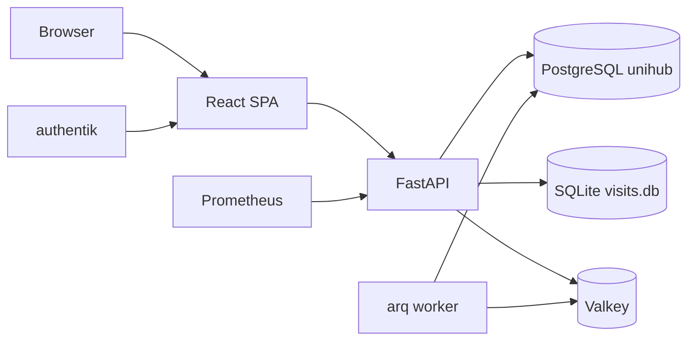

# UniHub Retail - Application Architecture

## Rol

UniHub Retail este aplicatia centrala pentru vanzarile retail MobiUp: dashboard operational, campanii focus, agenti, management de magazine, task-uri, HR, salarii si raportare de vizite.

## Stack si runtime

| Zona | Tehnologie |
| --- | --- |
| Frontend | React 19, TypeScript, Vite 8, Tailwind CSS 4.3, TanStack Query |
| Backend | FastAPI, asyncpg, Python |
| Auth | authentik OIDC, JWT RS256/JWKS |
| DB | PostgreSQL `unihub` pe `unihub_postgres:5432` |
| Queue/cache | Valkey + worker `unihub-worker.service` pentru importuri async |
| Observabilitate | Prometheus `/metrics`, GlitchTip, structured logs |
| Public URL | `https://retail.unihub.ro/` |
| Service | `unihub-backend.service` |

## Diagrama



## Meniuri

| Meniu principal | Scop |
| --- | --- |
| Hub | KPI-uri, comparatii perioade, carduri speciale |
| Focus | campanii, incentive, produse focus |
| Agenti | overview agenti, stabilitate, miscari, salarii |
| Management | `Echipa`, `Magazine`, `Tasks`, `HR` |
| Setari | setari aplicatie si erori |

## Functionalitati majore

- KPI retail si istoric lunar.
- Filtre globale firma / regional / magazin / agent.
- Campanii promo si incentive.
- Analiza agentilor, lifecycle, salarii.
- Management magazine, scoruri CRM, task-uri, concedii.
- Raportare vizite citita din SQLite shared.
- Import vanzari si refresh reporting agregat.
- Exporturi si rapoarte pentru management.

## Arhitectura backend

Backend-ul foloseste modelul `router -> service -> repository`.

| Domeniu | Exemple |
| --- | --- |
| Dashboard | `routers/dashboard.py` -> `services/dashboard_service.py` -> `repositories/dashboard.py` |
| Agenti | `agents.py` pe toate cele 3 straturi |
| Campanii | `campaigns.py` pe toate cele 3 straturi |
| HR/CRM/Tasks | straturi separate per domeniu |
| Import | `services/importer.py`, `services/imports.py`, job-uri Valkey |

## Baze de date

### PostgreSQL `unihub`

Familii de tabele:

| Familie | Tabele reprezentative |
| --- | --- |
| Master data | `stores`, `store_targets`, `focus_products` |
| Tranzactii | `sales_transactions`, `historical_annual_sales` |
| Campanii | `incentive_campaigns`, `incentive_products` |
| Reporting | `reporting_agent_*`, `reporting_item_*`, `reporting_focus_item_month`, `reporting_category_month` |
| Management | `tasks`, `leave_requests`, `attendance_records`, `store_scores`, `salary_records` |
| Operare | `import_snapshots`, `visits_snapshot`, `error_logs` |

### SQLite shared

- `data/visits/visits.db`
- Retail citeste raportarea vizitelor; FieldOps este noul flux operational pentru vizite.

## Integrari

- authentik pentru identity.
- Valkey pentru job queue.
- Hub consuma KPI-uri Retail prin API intern.
- Prometheus si Grafana pentru metrics.
- GlitchTip pentru erori.

## Teste si calitate

- Backend: `pytest`, `mypy`.
- Frontend: `vitest`, `tsc`, Playwright.
- Routerele principale au fost refactorizate la arhitectura pe 3 straturi.

## Puncte de intrare

```text
src/App.tsx
src/lib/tabs.ts
backend/main.py
backend/db/schema_v2.sql
backend/services/
backend/repositories/
```

## Gotchas

- DB-ul Retail este pe port `5432`, nu clusterul DWH de pe `5433`.
- Reporting-ul operational se citeste din tabelele `reporting_*`, nu direct din `sales_transactions`, cu exceptii controlate.
- Magazinele `TR %` sunt excluse din logica Retail.
- Cand `site_code` este prezent, domina scope-ul istoric.
- Vizitele sunt o dependinta istorica sensibila; nu modifica `visits.db` fara sa verifici fluxurile FieldOps/Retail.

