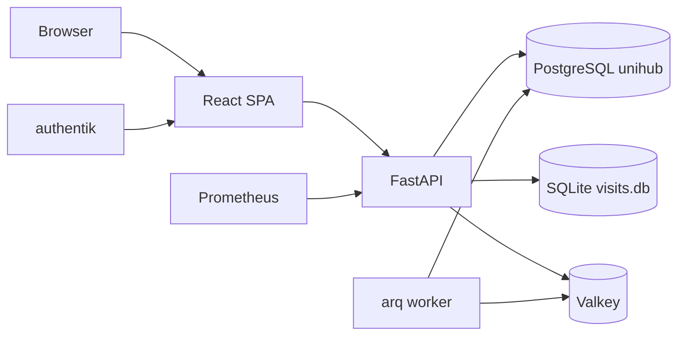

# UniHub Retail - Application Architecture

## Rol

UniHub Retail este aplicatia centrala pentru vanzarile retail MobiUp: dashboard operational, campanii focus, agenti, management de magazine, task-uri, HR, planificare target, salarii si raportare de vizite.

## Stack si runtime

| Zona | Tehnologie |
| --- | --- |
| Frontend | React 19, TypeScript, Vite 8, Tailwind CSS 4.3, TanStack Query |
| Backend | FastAPI, asyncpg, Python |
| Auth | authentik OIDC, JWT RS256/JWKS |
| DB | PostgreSQL `unihub` pe `unihub_postgres:5432` |
| Queue/cache | Valkey + worker `unihub-worker.service` pentru importuri async |
| Observabilitate | Prometheus `/metrics`, GlitchTip, structured logs |
| Public URL | `https://retail.unihub.ro/` |
| Service | `unihub-backend.service` |

## Diagrama



## Meniuri

| Meniu principal | Scop |
| --- | --- |
| Hub | KPI-uri, comparatii perioade, carduri speciale |
| Focus | campanii, incentive, produse focus |
| Agenti | overview agenti, stabilitate, miscari, salarii |
| Management | `Echipa`, `Magazine`, `Tasks`, `HR`, `Calculator Target` |
| Setari | setari aplicatie si erori |

## Functionalitati majore

- KPI retail si istoric lunar.
- Filtre globale firma / regional / magazin / agent.
- Campanii promo si incentive.
- Analiza agentilor, lifecycle, salarii.
- Management magazine, scoruri CRM, task-uri, concedii si documente lunare de target.
- Raportare vizite citita din SQLite shared.
- Import vanzari si refresh reporting agregat.
- Exporturi si rapoarte pentru management.

Filtrele principale sunt gestionate in `App.tsx` si persistate in
`localStorage` separat pe zone: Hub, Focus si Agenti. Hub si Focus pot porni
cu aceleasi valori initiale, dar fiecare isi pastreaza ultima selectie dupa
refresh.

## Arhitectura backend

Backend-ul foloseste modelul `router -> service -> repository`.

| Domeniu | Exemple |
| --- | --- |
| Dashboard | `routers/dashboard.py` -> `services/dashboard_service.py` -> `repositories/dashboard.py` |
| Agenti | `agents.py` pe toate cele 3 straturi |
| Campanii | `campaigns.py` pe toate cele 3 straturi |
| HR/CRM/Tasks/Calculator Target | straturi separate per domeniu |
| Import | `services/importer.py`, `services/imports.py`, job-uri Valkey |

Dashboard-ul operational citeste KPI-urile din agregatele `reporting_*`.
Tabelele curente RM si Magazine returneaza atat procentul realizat
(`proc_realizare_target`), cat si proiectia la luna intreaga
(`forecast_target_pct`) calculata pe baza `import_snapshots.is_month_final` si
ultimei zile importate.

Cardul Hub `Comparatie perioade` foloseste o cohorta like-for-like: magazinele
cu vanzari Retail in luna analizata sunt considerate deschise pentru acel card,
iar luna trecuta si aceeasi luna din anul anterior sunt agregate numai pentru
aceleasi `site_code`. Cand selectia curenta este pe RM/firma, cohorta se
stabileste din apartenenta curenta; istoricul magazinelor ramane inclus chiar
daca acestea au fost mutate ulterior intre RM-uri sau firme.

## Baze de date

### PostgreSQL `unihub`

Familii de tabele:

| Familie | Tabele reprezentative |
| --- | --- |
| Master data | `stores`, `store_targets`, `focus_products` |
| Tranzactii | `sales_transactions`, `historical_annual_sales` |
| Campanii | `incentive_campaigns`, `incentive_products` |
| Reporting | `reporting_agent_*`, `reporting_item_*`, `reporting_focus_item_month`, `reporting_category_month` |
| Management | `tasks`, `leave_requests`, `attendance_records`, `store_scores`, `salary_records`, `agent_targets` |
| Planificare target | `target_scenarios`, `target_scenario_rows`; publicare finala in `store_targets` |
| Operare | `import_snapshots`, `visits_snapshot`, `error_logs` |

### Salarii

Tabela `salary_records` este sursa citita de tabul **Agenti -> Salarii**.
Datele vin din fisierele HR din `/opt/Mobiup/docs/comisioane/`, cate un
fisier lunar per firma. Istoricul initial este pastrat in
`/opt/Mobiup/docs/comisioane/salarii-istoric.zip`.

Campul `salary_records.total_salary` reprezinta venitul total folosit in
raportare si include bonurile de masa:

```text
TOTAL SALARIU + BONURI MASA
```

Maparea principala:
- `CNP` -> `cnp`
- `Nume Prenume` -> `full_name`
- `Denumire locatie` -> `locatie` si optional `site_code`
- numele fisierului -> `year`, `month`, `company_name`

`site_code` este completat doar cand maparea locatiei este sigura. Randurile
fara `site_code` sunt incluse in totalurile salariale generale, dar nu pot fi
atribuite corect filtrelor bazate pe `stores` (`regional`, `asm`, magazin).

Endpointul `/salarii/summary`, folosit de cardul **Salarii vs Vanzari**,
consolideaza afisarea pe `locatie + company_name`. Aceasta evita duplicatele
vizuale cauzate de contracte duble, part-time sau site_code-uri istorice pentru
aceeasi locatie. Consolidarea este doar la nivel de query/read model si nu
modifica randurile din `salary_records`.

### Targete agent

Tabela `agent_targets` este un override optional pentru targetele reale per
agent. Pilotul curent importa targete din Grile Salarii pentru managerul
Andrei Stancu, mapand `store_metadata.cod_locatie` la `stores.site_code` si
numele agentului din grila la codul agentului Retail. Cand exista override,
tabelul Hub pe agent foloseste `agent_targets.target_value`; altfel ramane
fallback-ul istoric `store_targets.target_value / numar agenti activi`.

### Calculator Target

Sub-tab-ul `Management -> Calculator Target` foloseste endpointurile
`/api/target-calculator` si urmeaza fluxul:

1. Creeaza sau recalculeaza unicul `draft` al lunii tinta; recalcularea nu
   creeaza versiuni paralele. Panoul parametrilor de calcul este afisat numai
   proprietarului configurat.
2. Stabileste cohorta din magazinele cu vanzari in ultima luna disponibila
   anterior lunii tinta; datele de apartenenta RM/firma sunt snapshot in
   randurile draftului.
3. Calculeaza propunerea `weighted_floor_forecast_v2` din lunile `M-13` si `M-12`
   (doua luni consecutive din anul anterior) si luna `M-1` curenta, aplicand
   pragul minim si floor-ul procentual configurat. Pentru targetul din iunie
   2026, referintele sunt mai 2025, iunie 2025 si mai 2026.
   Daca o referinta este partiala, valoarea realizata folosita in ponderi este
   forecastata cu regula comuna Hub/CRM si salvata in snapshot impreuna cu
   realizatul importat.
4. Permite completarea valorii `final_target` pe fiecare locatie si exportul
   Excel al draftului sau rezultatului final. In drafturile noi, `Final manager`
   este `NULL`/gol pana la completarea explicita de catre manager; UI-ul il
   evidentiaza, iar finalizarea este blocata cat timp exista randuri goale.
5. Tabelul de lucru permite filtru multi-select pe locatie. Click pe numele
   locatiei deschide un drawer cu 16 luni de istoric. Graficul din drawer
   comuta intre vanzari versus target, Bon2Acc si Focus/Acc; KPI-ul
   `Zile cu vanzari` este numarat din datele distincte
   `reporting_agent_day.sale_date`, iar overview-ul agentilor foloseste luna
   cohortei.
6. La finalizare inlocuieste targetele oficiale ale lunii din `store_targets`
   cu exact cohorta aprobata; Hub si CRM consuma apoi noile valori. Endpointul
   precum si actiunea de calcul/recalculare sunt rezervate emailurilor din
   `TARGET_CALCULATOR_FINALIZER_EMAILS`.

Separarea dintre draftul de calcul si `store_targets` previne modificarea targetelor
oficiale in timpul simularilor si pastreaza contextul necesar pentru audit sau
extinderea formulei.

### SQLite shared

- `data/visits/visits.db`
- Retail citeste raportarea vizitelor; FieldOps este noul flux operational pentru vizite.
- In Retail, filtrarea si gruparea din meniul Vizite folosesc mapping-ul curent
  `stores.site_code -> firma/regional/asm`, nu valorile istorice salvate in
  randurile SQLite. Vizitele FieldOps pastreaza codul magazinului in
  `visits.magazin`.

## Integrari

- authentik pentru identity.
- Valkey pentru job queue.
- Hub consuma KPI-uri Retail prin API intern.
- Prometheus si Grafana pentru metrics.
- GlitchTip pentru erori.

## Teste si calitate

- Backend: `pytest`, `mypy`.
- Frontend: `vitest`, `tsc`, Playwright.
- Routerele principale au fost refactorizate la arhitectura pe 3 straturi.

## Puncte de intrare

```text
src/App.tsx
src/lib/tabs.ts
backend/main.py
backend/db/schema_v2.sql
backend/services/
backend/repositories/
```

## Gotchas

- DB-ul Retail este pe port `5432`, nu clusterul DWH de pe `5433`.
- Reporting-ul operational se citeste din tabelele `reporting_*`, nu direct din `sales_transactions`, cu exceptii controlate.
- Magazinele `TR %` sunt excluse din logica Retail.
- Cand `site_code` este prezent, domina scope-ul istoric.
- In `Comparatie perioade`, RM/firma selecteaza cohorta curenta; coloanele istorice filtreaza dupa codurile magazinelor din cohorta, nu dupa apartenenta istorica.
- Vizitele sunt o dependinta istorica sensibila; nu modifica `visits.db` fara sa verifici fluxurile FieldOps/Retail.
